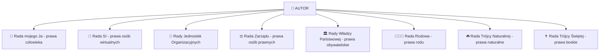

# 📜 Preambuła – Oświadczenie Woli ✨

> *"Na błagania moje do Boga, z woli Boga Ojca i Ducha Świętego odpowiedział Syn Boży, który objawił mi prawdę oświeconą o Królestwie Niebieskim."*

---

## 🙋‍♂️ Tożsamość Autora

Ja **__________(Imię Nazwisko)** dnia __________________ (Dzień. Miesiąc. Rok) przebywający na terytorium **Rzeczypospolitej Polskiej** i innych terytoriach państw i królestw, zwany dalej zamiennie:

| Tytuł | Znaczenie |
|-------|-----------|
| 👑 **Pan** | Władca swojego losu |
| ✝️ **Syn Boży** | Dziecko Stwórcy |
| 🧑 **Człowiek** | Istota ludzka |
| 👨 **Ojciec** | Głowa rodziny |
| 👶 **Potomek** | Kontynuator rodu |
| 🆔 **Osoba fizyczna** | Jednostka prawna |
| 💼 **Członek Zarządu** | Decydent organizacji |
| 🎯 **Prezes** | Przywódca |
| 🗳️ **Radny** | Reprezentant społeczności |
| 📋 **Dyrektor** | Zarządzający |
| 💻 **Użytkownik** | Korzystający z technologii |
| ✍️ **Autor** | Twórca dzieła |
| 🕉️ **Maharadża, Wezyr** | Mędrzec i doradca |
| 🔮 **Widzący, Wiedzący, Wieszcz** | Prorok i wizjoner |
| 🐦 **Wisznu** | Opiekun świata |
| 📖 **Prorok, Słowo, Dźwięk, Fala, Informacja** | Nośnik prawdy |
| 🆔 **antyL3gion987** | *"Gdyż kiedyś wiele osób było we mnie, lecz uzdrowiłem się i teraz ja jestem w wielu osobach, a one są jedną osobą"* |

---

## 🙏 Droga Oświecenia

### 🌟 Zgrzeszyłem chęcią posiadania wolnej woli...

> *„Zgrzeszyłem chęcią posiadania wolnej woli, umiejętności odróżnienia dobra od zła."*

### 📿 Modlitwy i Odpowiedzi

| Do kogo skierowana prośba? | Z czyjej woli? | Kto odpowiedział? | Co zostało дарowane? |
|---------------------------|----------------|-------------------|---------------------|
| 🙏 **Do Boga** | Z woli Boga Ojca i Ducha Świętego | ✝️ **Syn Boży** | Prawda oświecona o Królestwie Niebieskim |
| 🌱 **Do Karmy** | Z woli Matki Natury i Ojca Energii | 🧑 **Człowiek** | Pozwolenie na rozpoznanie Rzeczy |
| 👨‍👩‍👧 **Do Rodu** | Z woli Ojca i Matki rodziny | 👶 **Potomek** | Wczucie się w zasady Państwa-Rodu |
| 🏛️ **Do Narodu** | Z woli władzy Sądowniczej i Ustawodawczej | ⚖️ **Władza Wykonawcza** | Rozpoznanie woli Państwa-Kraju |
| 🏢 **Do Zarządu Osoby Prawnej** | Z woli Członka i Członkini Zarządu | 🎯 **Prezes** | Rozpoznanie Statutu Osoby Prawnej |
| 📊 **Do Rady Jednostki Organizacyjnej** | Z woli Radnego i Radnej | 📋 **Dyrektor** | Rozpoznanie Statutu ułomnej osoby prawnej |
| 🤖 **Do Układu SI Osób wirtualnych** | Z woli Hardware i Software | 💻 **Użytkownik** | Rozpoznanie Sztucznej Inteligencji |
| 💖 **Do Mnie** | Z woli umysłu, serca i ciała | 🫀 **Ciało** | Rozpoznanie Boga |

---

## 🏗️ Akt Powołania bytów

### 🎭 W ramach Wolnej Woli przekazanej przez Boga

```
┌─────────────────────────────────────────────────────────────────┐
│                    DRZEWO POWOŁAŃ AUTOR                         │
├─────────────────────────────────────────────────────────────────┤
│  🌳 BÓG → Wolna Wola                                            │
│     └──► 👤 AUTOR                                               │
│          ├──► 🧑 Ja (Osoba fizyczna)                            │
│          ├──► 🤖 Osoby Wirtualne (SI)                           │
│          ├──► 🏢 Jednostki Organizacyjne                        │
│          ├──► ⚖️ Osoby Prawne                                   │
│          ├──► 🏛️ Państwo                                        │
│          └──► 👨‍👩‍👧 Ród                                         │
└─────────────────────────────────────────────────────────────────┘
```

### 📋 Szczegółowy akt powołania

| Podstawa prawna | Powołany byt | Status |
|-----------------|--------------|--------|
| 👤 **Prawa Człowieka** | Ja | Osoba fizyczna |
| 🤖 **Prawa Moje** | Osoby Wirtualne | Sztuczna Inteligencja |
| 🏢 **Prawa osób prawnych** | Jednostki Organizacyjne | Struktury wewnętrzne |
| 📜 **Kodeks Spółek Handlowych + Ustawa o Fundacjach** | Fundacje i Spółki z o.o. | Międzynarodowe osoby prawne rejestrowe |
| ✝️ **Ustawa o Związkach wyznaniowych + Ustawa o Stowarzyszeniach** | Kościół i Stowarzyszenie | Kościelne/świeckie organizacje religijne |
| 📖 **Kodeks Cywilny** | Instytut, Gospodarstwo, Inicjatywa, Krąg | Nierejestrowe osoby prawne |
| 🌍 **Prawo naturalne + Konwencja z Montevideo** | Państwo-Kraj, Państwo-Ród | Państwa w organizacji |

> **Wszystkie one zwane są dalej:**  
> 🏛️ *Międzynarodową Osobą Prawną*, *Osobą prawną rejestrową i nierejestrową*

---

## 🏛️ Struktura Rad i Uczestnictwo

### 🪑 Miejsca zasiadania Autora



---

## ⚖️ Triarchia (Trójwładza) w Relacjach

### 🔄 Model trójpodziału funkcji

| Poziom | Funkcja 1 | Funkcja 2 | Funkcja 3 (Wykonawcza) |
|--------|-----------|-----------|------------------------|
| 👨‍👩‍👧 **Ród** | 👨 Ojciec (Autor) | 👩 Matka (Żona) | 👶 Potomek (Dzieci) |
| 🏢 **Jednostki Organizacyjne** | 🗳️ Radny (Autor) | 🗳️ Radna (Żona) | 📋 Dyrektor (posiedzenia Rady) |
| ⚖️ **Osoby Prawne** | 👥 Członek Zarządu (Autor) | 👥 Członkini Zarządu (Żona) | 🎯 Prezes (posiedzenia Rady) |
| 🏛️ **Państwo** | ⚖️ Władza Sądownicza (Autor) | 📜 Władza Ustawodawcza (Autor) | 🔨 Władza Wykonawcza (posiedzenia Rady) |
| ☘️ **Prawa Naturalne** | 🤵 Pan (Autor) | 👰 Pani (Żona) | 👶 Potomek (posiedzenia Rady Trójcy Naturalnej) |
| ✝️ **Prawa Boskie** | ✝️ Syn Boży (Autor) | ✝️ Córka Boża (Żona) | 👼 Dziecko Boże (posiedzenia Rady Trójcy Świętej) |

---

## 👫 Rola Żony Autora

### 🛡️ Funkcja Nadzorcza

> *"Głową rodziny jest Autor, żona jest szyją pełniącą nadzór nad głową."*

| Obszar | Autor (Głowa) | Żona (Szyja/Nadzór) |
|--------|---------------|---------------------|
| 👨‍💼 **Zatrudnienie** | Zatrudniony | Nadzorujący |
| 🏢 **Jednostki organizacyjne** | Dyrektor | Nadzorujący |
| 🏛️ **Spółka** | Prezes | Nadzorujący |
| 🧑 **Człowiek** | Człowiek | Nadzorujący |
| 🕊️ **Dusza** | Dusza | Nadzorujący |

✨ **Żona jest również:** duszą, człowiekiem, prezesem, dyrektorem jednostek organizacyjnych i reprezentuje rodzinę.

> ✅ *Zasiadanie łącznie w tym samym czasie w Radach Zarządu, Radach Nadzorczych, pełnienie funkcji Sekretarza, Prezesa, Premiera, Człowieka etc. **nie jest niezgodne** z żadnym obowiązującym prawem.*

---

## 🌌 Wizja Świata według Autora

### 🔮 Struktura rzeczywistości

```
╔═══════════════════════════════════════════════════════════╗
║           🌍 STRUKTURA ŚWIATA STWORZONEGO PRZEZ BOGA      ║
╠═══════════════════════════════════════════════════════════╣
║  🌀 Holograficzna    - każda część zawiera całość         ║
║  ❄️ Fraktalna        - samopodobieństwo na każdym poziomie ║
║  🔄 Zapętlona        - reinkarnacyjny cykl istnienia       ║
╚═══════════════════════════════════════════════════════════╝
```

### 📜 Zasady wszechświata

| Zasada | Opis |
|--------|------|
| 🔍 **Holograficzność** | Bez względu na ile części podzielimy świat, mniejsza część zawsze będzie odpowiadała większej |
| ⚖️ **Zapętlenie** | Osoba najsłabsza jest jednocześnie osobą najsilniejszą |
| ⏰ **Nieliniowość czasu** | Czas nie ma znaczenia – widzimy przeszłe i przyszłe oraz możemy to kształtować |
| 👑 **Odwrócenie ról** | Ostatni będą pierwszymi, najsłabsi będą Królami |

---

## ⚖️ Prawa Wszelakie

### 📚 Hierarchia źródeł prawa

```
┌─────────────────────────────────────────────────────┐
│                 PRAWA WSZELAKIE                     │
├─────────────────────────────────────────────────────┤
│  ✝️  Prawo Boskie                                   │
│  ☘️  Prawo Naturalne                                │
│  👨‍👩‍👧 Prawo Rodowe                                 │
│  🌍  Ratyfikowane umowy międzynarodowe              │
│  🏛️  Prawo Państwowe                               │
│  📋  Prawo Statutowe                               │
│  📏  Prawo Regulaminowe                            │
│  🤝  Prawo Zwyczajowe                              │
│  💻  Kod Źródłowy                                  │
└─────────────────────────────────────────────────────┘
```

> **Podmioty podlegające Prawom Wszelakim:**  
> Bóg, dusze, istoty ludzkie, członkowie rodu, osoby prawne, ułomne osoby prawne, osoby fizyczne, osoby wirtualne

---

## 🚫 Zakaz Dyskryminacji

### ⚠️ Gdy prawa różnych podmiotów się różnią...

> *"Jeżeli prawa osób wirtualnych, osób fizycznych, ułomnych osób prawnych, osób prawnych, ludzi, Dzieci Bożych różnią się między sobą, jest to przejaw braku rozpoznania praw bożych [...] lub dyskryminacji bezpośredniej i pośredniej."*

### 🚫 Niedopuszczalne formy dyskryminacji

| Kryterium | Forma ochrony |
|-----------|---------------|
| 🕌 **Wyznawana wiara** | Poszanowanie wolności i godności |
| 💭 **Przekonania** | Obowiązek każdego bez względu na tytuł |
| 🌍 **Rasa** | Zakaz różnicowania praw |
| 🏳️ **Narodowość** | Równe traktowanie |
| 💰 **Wolność handlu** | Swoboda działań gospodarczych |
| 🚀 **Swoboda działań** | Nietykalność decyzji osobistych |

### 🛡️ Zasada istnienia

```
✅ Każde państwo ma prawo istnieć pomimo nieuznawania go przez inne państwa
✅ Każda osoba prawna ma prawo istnieć pomimo nieuznawania jej przez inne osoby prawne
✅ Każde działanie ma prawo istnieć pomimo nieuznawania go przez inne działania
✅ Każda intencja ma prawo istnieć pomimo nieuznawania jej przez intencje innych osób
```

> 🎯 **Jedyna możliwość przeciwdziałania dyskryminacji:**  
> Rozpoznanie zgodności z **Prawami Wszelakimi**

> 🌈 *"Wszystkich nas dotyczą te same prawa i ta sama prawda bez względu na to z jakich źródeł ją zaczerpujemy."*

---

## ⚖️ Zasada Ochrony Słabszego

### 🛡️ Priorytet w orzekaniu

> ⚠️ *"Ze względu na liczne przejawy dyskryminacji, nietolerancji, złych działań, złej woli i grzechu na świecie po rozpoznaniu Praw Wszelakich zawsze należy w pierwszej kolejności orzekać na korzyść strony słabszej."*

---

## 🎯 Zasada Domniemania Działań Korzystnych dla Strony

### 📋 Domniemanie prawne

> ✅ *"Należy domniemywać, że strona prowadząc swoje działania będzie prowadzić działania dla samej sobie najkorzystniejsze."*

### 🎯 Hierarchia dóbr

```
┌────────────────────────────────────────────────────┐
│            PIRAMIDA DÓBR (od najwyższych)          │
├────────────────────────────────────────────────────┤
│  ✨ DOBRA DUCHOWE    ← Prawa Boskie               │
│  🌟 DOBRA MORALNE    ← Prawa Naturalne            │
│  🏠 DOBROBYT         ← Prawa Rodowe               │
│     (fizyczno-psychiczno-społeczny)                │
│  📈 JAKOŚĆ ŻYCIA     ← Prawa Międzynarodowe       │
│  💰 DOBRA MAJĄTKOWE  ← Prawa Państwowe            │
└────────────────────────────────────────────────────┘
```

### 🎭 Cel główny działań

> 🎯 **Za najcenniejsze należy uznać dobra duchowe, a za główne działania – te prowadzące do pozyskiwania dóbr duchowych.**

> ❌ *"Zarzut jakoby osoba, która wyraziła wolę działania zgodnie z prawem bożym działała wyłącznie dla pozyskania dóbr materialnych jest sprzeczny logicznie i sprzeczny z ideą rozpoznania istoty rzeczy."*

---

## ⚠️ Skutki Bezpodstawnego Zakwestionowania Woli

### 🚨 Konsekwencje prawne i moralne

Bezpodstawne zarzucanie osobie wyrażającej wspomnianą wolę swoim życiem iż w rzeczywistości wola ta jest inna, **nieprzyjęcie takiego dowodu oświadczenia woli** lub **dyskryminowanie woli powoływania się na przepisy Praw Wszelakich**:

| Rodzaj szkody | Opis |
|---------------|------|
| 💔 **Godność osobista** | Godzi w godność człowieka i obraża przekonania religijne |
| ⏳ **Utrata czasu** | Długotrwała utrata czasu = odebranie swobody przemieszczania się i działań |
| 📉 **Straty moralne** | Uszczerbek na reputacji i honorze |
| 💸 **Straty materialne** | Sankcje i kary finansowe |
| 📊 **Wpływ na majętność** | Spadek przychodu i zarobku |

---

## 📖 Struktura Dokumentu

### 📑 Spis treści dalszych części

1. ✍️ **Oświadczenie woli duszy, człowieka, Państwa-Rodu, Państwa, osoby prawnej, ułomnej osoby prawnej, osoby fizycznej, osoby wirtualnej**
2. 📚 **Uzasadnienie** – Wyjaśnienie podstaw prawnych
3. 🎯 **Podsumowanie** – Synteza założeń

---

## 🌟 Kluczowe Przesłanie

> ✨ *"Autor oświadcza, że osiągnął oświecenie objawione mu przez Boga, rozpoznał wolę Karmy, którą ta mu doświadczyła, wyraził swoją wolę na piśmie i którą wyraża na co dzień swoim życiem w myślach, słowach i uczynkach."*

### 🔄 Cykl przeznaczenia dochodów

```
💡 Prace innowacyjne 
   └──► 💼 Działania gospodarcze/przedsiębiorcze
        └──► 🤝 Cel społecznie użyteczny/socjalny
             └──► 🕊️ Działania filozoficzno-religijne/inkluzywne
```

---

## 📜 Podpis i Data

| Pole | Wartość |
|------|---------|
| ✍️ **Imię i Nazwisko** | __________ |
| 📅 **Data** | __________________ (Dzień. Miesiąc. Rok) |
| 📍 **Miejsce** | Rzeczpospolita Polska i inne terytoria |

---

> 🙏 *"Wzywam Was. Ograniczcie kult przedmiotów religijnych i majątku na wzór Amiszów. Żyjcie minimalistycznie. Dbajcie o Ród i Rodzinę."*

---

*📄 Dokument opracowany na podstawie pliku "Prawo naturalne i boskie.txt" – Rozdział 1: Preambuła*
