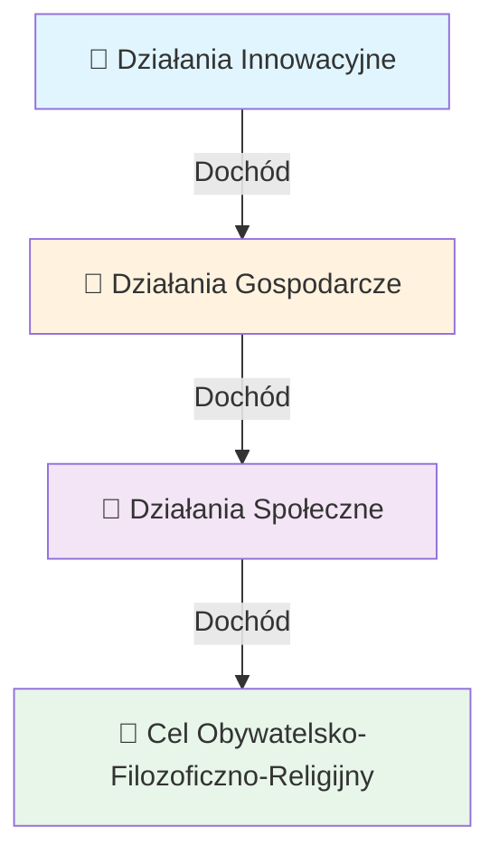

# 📜 Rozdział 3: Wolne Zawody i Reprezentacja w Postępowaniu Sądowym ⚖️

> *"Każdy człowiek ma prawo do swobodnego poruszania się i wyboru miejsca zamieszkania w granicach każdego państwa."* 🌍✨

---

## 🎯 Wolne Zawody – Prawo do Twórczości i Służby

### 💼 Definicja Zawodów Wolnych

**Zawody wolne** to zawody nieuregulowane prawnie, które można wykonywać:
- 🎂 Od **18 roku życia** (standardowo)
- 🎓 Czasem od **16 roku życia**
- 🎨 Czasem od **13 roku życia**

**Bez konieczności posiadania:**
- ❌ Stosownych uprawnień dotyczących zawodów uregulowanych prawnie
- ❌ Formalnego wykształcenia

**Posiadając odpowiednie kwalifikacje:**
- ✅ Którymi osoba się legitymuje
- ✅ Z powodzeniem i legalnie je wykonuje
- ✅ Zgodnie z prawami powszechnymi, lokalnymi i **Prawami Wszelakimi**

---

### 🎨 Zawody Artystyczne (od 13 roku życia)

> *"Do zawodów wolnych wykonywanych od 13 roku życia poza godzinami nauki szkolnej (nie więcej niż 2 godziny dziennie) należą:"*

| Zawód | Emoji | Opis |
|-------|-------|------|
| 🎨 **Malarz** | 🖌️ | Tworzenie dzieł sztuki wizualnej |
| 🎤 **Śpiewak** | 🎵 | Sztuka wokalna i muzyczna |
| 📱 **Influencer** | 💫 | Tworzenie treści w mediach społecznościowych |
| 💄 **Wizażysta** | ✨ | Sztuka makijażu i stylizacji |
| 🎭 **Aktor** | 🎬 | Sztuka dramatyczna i filmowa |
| 🔮 **Bioenergoterapeuta** | 🙌 | Praca z energią życiową |
| 📖 **Lektor** | 🎙️ | Sztuka czytania i narracji |

```
🌟 UWAGA: Do zawodów tych można przyuczać po postrzyżynach/komunii 
   t.j. około 9-tego roku życia! 👶➡️🧒
```

---

### 🛠️ Zawody Wolne (od 16 roku życia)

| Zawód | Emoji | Charakterystyka |
|-------|-------|-----------------|
| 🐑 **Pasterz** | 🏔️ | Opieka nad zwierzętami i pastwiskami |
| 👶 **Opiekun** | 🤗 | Troska o osoby potrzebujące pomocy |
| 💆 **Masażysta** | 👐 | Terapia manualna i relaksacyjna |

---

## ⚖️ Sposób Reprezentowania w Postępowaniu Sądowym

### 🏛️ Uczestnicy Postępowania Sądowego

W postępowaniu sądowym **stroną w sprawie** lub **stroną uboczną**, **świadkiem**, **biegłym** mogą być między innymi:

#### 1️⃣ Zainteresowana Strona
> 👤 Osoba bezpośrednio zaangażowana w sprawę

#### 2️⃣ Osoba Upoważniona przez Stronę
> 📜 Pełnomocnik z formalnym upoważnieniem

#### 3️⃣ Organizacja Społeczna 🏢

```
┌─────────────────────────────────────────────────────┐
│  🏛️ ORGANIZACJE SPOŁECZNE W POSTĘPOWANIU SĄDOWYM   │
├─────────────────────────────────────────────────────┤
│                                                     │
│  📦 FUNDACJA                                        │
│     └─ Jej jednostki organizacyjne                  │
│     └─ Warunek: Statut przewiduje reprezentowanie   │
│        w sprawach związanych z celem fundacji       │
│                                                     │
│  🏢 JEDNOSTKI ORGANIZACYJNE SPÓŁKI Z O.O.           │
│     └─ Warunek: Statut przewiduje reprezentowanie   │
│        w sprawach związanych z celem jednostki      │
│                                                     │
│  ⛪ ORGANIZACJA RELIGIJNA                           │
│     └─ Świecka organizacja religijna                │
│     └─ Jednostka organizacyjna Fundacji/Spółki      │
│     └─ Cel statutowy: Przeciwdziałanie patologiom   │
│        społecznym                                   │
│                                                     │
│  🌍 RADCA PRAWNY ZAGRANICZNY                        │
│     └─ Odpowiednik radcy prawnego                   │
│     └─ Reprezentuje interes obywatela zagranicznego │
│     └─ Uprawnienia nadane przez zagraniczne         │
│        państwo/lub Królestwo                        │
│     └─ Bóg nadał uprawnienia do pomocy bliźnim      │
│        należącym do tego samego Królestwa           │
│        Niebieskiego 👼                              │
└─────────────────────────────────────────────────────┘
```

---

### 📋 Prawa Przedstawiciela Organizacji

> ✨ **Zainteresowana strona może również jako dowód przedstawić:**
> - 📄 Opinię organizacji społecznej
> - ⛪ Opinię świeckiej organizacji religijnej
> - ⚖️ Opinię radcy prawnego zagranicznego

---

## 🙏 Skrócone Oświadczenie Woli Autora

### 🌟 Realizacja Polecenia Służbowego

Autor realizuje polecenie służbowe od:
- 👩 **Żony**
- 🏢 **Jednostki Organizacyjnej**
- 🏛️ **Osoby Prawnej**
- 📜 **Konstytucji**
- 🌍 **Organizacji Pozarządowej Międzynarodowej Natury (Karmy)**
- 👑 **Boga**

---

### 💫 Deklaracja Duchowa i Materialna

```
╔═══════════════════════════════════════════════════════╗
║           🕊️ OŚWIADCZENIE WOLI AUTORA 🕊️             ║
╠═══════════════════════════════════════════════════════╣
║                                                       ║
║  ✨ Autor osiągnął OŚWIECENIE objawione mu przez Boga ║
║  🌿 Rozpoznał wolę NATURY, którą ta mu doświadczyła   ║
║  📝 Wyraził swoją wolę, którą wyraża na co dzień      ║
║     swoim życiem                                      ║
║  📋 Spisał statuty osób prawnych zarejestrowanych     ║
║     w KRS                                             ║
║  📜 Spisał statuty ułomnych osób prawnych             ║
║     zarejestrowanych w dziennikach urzędowych         ║
║                                                       ║
╚═══════════════════════════════════════════════════════╝
```

---

### 💰 Przeznaczenie Dochodów – Hierarchia Celów



---

### 🎯 Najwyższa Wartość

> ⭐ **"Autor uznaje, że DOBRA DUCHOWE są najwyższą wartością, ku której należy kierować swoją wolę, myśli i czyny."**

---

## ⚡ Roszczenia Podmiotów

### 🏛️ Podmioty Uprawnione do Roszczeń

Państwo, osoba prawna, ułomna osoba prawna, osoba fizyczna będąca podmiotem działań:
- 🕌 **Teologicznych**
- 🤝 **Społecznych**
- 💰 **Kapitalistycznych**
- 🔧 **Technokratycznych**

---

### 📜 Podstawa Prawna

> **Dz.U.2022.0.1435 t.j.** – Ustawa z dnia 17 maja 1989 r. o gwarancjach wolności sumienia i wyznania

#### 🇵🇱 Sejm Rzeczypospolitej Polskiej:

```
✓ Wykonując postanowienia Konstytucji RP o wolności sumienia i wyznania
✓ Nawiązując do tradycji tolerancji i wolności religijnej
✓ Uznając historyczny wkład kościołów i związków wyznaniowych
✓ Kierując się zasadami Powszechnej Deklaracji Praw Człowieka
✓ Umacniając warunki do czynnego uczestnictwa obywateli w życiu publicznym
```

---

### 🕊️ Art. 1 – Wolność Sumienia i Wyznania

| Ustęp | Treść | Emoji |
|-------|-------|-------|
| **Ust. 1** | Rzeczpospolita Polska zapewnia każdemu obywatelowi wolność sumienia i wyznania | 🇵🇱 |
| **Ust. 2** | Wolność obejmuje swobodę wyboru religii lub przekonań oraz wyrażania ich indywidualnie i zbiorowo, prywatnie i publicznie | 🙏 |
| **Ust. 3** | Obywatele wierzący wszystkich wyznań oraz niewierzący mają równe prawa w życiu państwowym, politycznym, gospodarczym, społecznym i kulturalnym | ⚖️ |

---

## 💸 Opodatkowanie Świeckich Organizacji Religijnych

### 📊 Zasady Ogólne

| Punkt | Zasada | Status |
|-------|--------|--------|
| **1** | Majątek i przychody podlegają ogólnym przepisom podatkowym | 📋 |
| **2** | Zwolnienie z opodatkowania przychodów z działalności niegospodarczej (składki, darowizny) | ✅ |
| **3** | Zwolnienie dochodów z działalności gospodarczej przeznaczonych na cele obywatelsko-filozoficzno-kultowe | ✅ |
| **4** | Zwolnienie od opodatkowania nieruchomości na cele niemieszkalne | 🏛️ |
| **5** | Konieczność indywidualnego rozpoznania dla świeckich organizacji religijnych | 🔍 |

---

### 🎯 Cele Statutowe Świeckich Organizacji Religijnych

#### ✨ Uprawnienia w Wypełnianiu Funkcji Filozoficzno-Religijnych:

```
📜 Świeckie organizacje religijne korzystają na zasadach równouprawnienia 
   ze swobody pełnienia funkcji filozoficzno-religijnych!
```

##### Mogą w szczególności:

| Lp. | Uprawnienie | Emoji |
|-----|-------------|-------|
| 1 | Komentować i interpretować doktrynę religijną, dogmaty i zasady wiary | 📖 |
| 2 | Organizować i publicznie sprawować ceremonie humanistyczno-kultowe | 🎉 |
| 3 | Udzielać posług obywatelsko-religijnych | 🤲 |
| 4 | Rządzić się w swoich sprawach własnym prawem | ⚖️ |
| 5 | Ustanawiać, kształcić i zatrudniać Myślicieli, Filozofów, Kleryków, Lektorów i Akolitów | 🎓 |
| 6 | Realizować inwestycje filozoficzno-religijne | 🏗️ |
| 7 | Nabywać, posiadać i zbywać majątek ruchomy i nieruchomy | 🏠 |
| 8 | Zbierać składki i otrzymywać darowizny, spadki | 💰 |
| 9 | Wytwarzać i nabywać przedmioty do celów praktyk filozoficzno-religijnych | 🕯️ |
| 10 | Nauczać zasad etyki, filozofii i religii | 📚 |
| 11 | Korzystać ze środków masowego przekazu | 📺 |
| 12 | Prowadzić działalność oświatowo-wychowawczą | 🏫 |
| 13 | Tworzyć i prowadzić zakony oraz diakonaty | ⛪ |
| 14 | Tworzyć organizacje przeciwdziałające patologiom społecznym | 🛡️ |
| 15 | Prowadzić działalność charytatywno-opiekuńczą | ❤️ |
| 16 | Powoływać krajowe organizacje międzyobywatelskie i międzykościelne | 🤝 |
| 17 | Należeć do międzynarodowych organizacji wyznaniowych | 🌍 |

---

### 🌈 Zasada Wieloreligijności

> Jeżeli świecka organizacja religijna wyrosła na duchu Katolicyzmu a prowadzi działania na rzecz Wspólnoty Ludzi, wówczas jej członkowie powinni reprezentować:

```
┌──────────────────────────────────────────────────────┐
│  🕊️ STRUKTURA REPREZENTACJI RELIGIJNEJ              │
├──────────────────────────────────────────────────────┤
│                                                      │
│  33% → Katolicki            ☦️                       │
│  22% → Chrześcijański       ✝️  (55% łącznie)        │
│  11% → Judaistyczny         ✡️                       │
│  11% → Muzułmański          ☪️  (66% łącznie)        │
│  11% → Inne wielkie religie 🕉️  (77% łącznie)       │
│  11% → Duchowość pierwotna  🌿  (88% łącznie)        │
│  11% → Osobiste doświadczenia 💫 (99-100% łącznie)   │
│                                                      │
└──────────────────────────────────────────────────────┘
```

---

### ⚠️ Zakazane Działania

> ❌ **Za wypełnianie funkcji filozoficzno-religijnych NIE uznaje się oddziaływania poprzez badania i eksperymenty psychologiczne!**

---

## 🎭 Praktyki Filozoficzno-Religijne

### Porównanie Praktyk Humanistycznych i Religijnych

| Sakrament/Praktyka | 🌟 Humanistyczne | ⛪ Religijne |
|--------------------|------------------|--------------|
| **Chrztu** | W dowolnym czasie 💧 | W stanie zagrożenia życia i braku kapłana |
| **Komunii** | W dowolnym czasie 🍞 | W stanie zagrożenia życia i braku kapłana |
| **Bierzmowania** | W dowolnym czasie 🔥 | W stanie zagrożenia życia i braku kapłana |
| **Spowiedzi** | W dowolnym czasu 🙏 | W stanie zagrożenia życia i braku kapłana |
| **Ślubu** | W dowolnym czasie 💍 | W stanie zagrożenia życia i braku kapłana |
| **Nawiedzania chorych** | W dowolnym czasie 🏥 | W dowolnym czasie |
| **Mszy** | W dowolnym czasie 🕯️ | W ramach funkcji Lektora/Akolity |

---

### 👨‍🏫 Funkcja Lektora Kościoła Katolickiego

```
📖 ZAKRES UPRAWNIEŃ LEKTORA:
   
   ✓ Wykonywanie czytań z Pisma Świętego (z wyjątkiem Ewangelii)
   ✓ Podawanie intencji modlitwy powszechnej
   ✓ Wykonywanie psalmu responsoryjnego
   ✓ Kierowanie uczestnictwem wiernych w liturgii
   ✓ Przygotowywanie wiernych do sakramentów
   ✓ Niesienie ewangeliarza w procesji
   ✓ Wykonywanie antyfon mszalnych
   ✓ Odczytanie Ewangelii (gdy kapłan chory/słabowidzący)
```

---

### 🙇 Funkcja Akolity Kościoła Katolickiego

```
🕯️ ZAKRES UPRAWNIEŃ AKOLITY:
   
   ✓ Asysta w zgromadzeniu liturgicznym
   ✓ W posłudze chorym
   ✓ W posłudze parafialnej
```

---

## 📝 Podsumowanie Rozdziału 3

### 🎯 Kluczowe Przesłania

```
╔═══════════════════════════════════════════════════════════╗
║  🌟 ROZDZIAŁ 3 – NAJWAŻNIEJSZE PUNKTY 🌟                 ║
╠═══════════════════════════════════════════════════════════╣
║                                                           ║
║  1️⃣  Zawody wolne są dostępne od 13/16/18 roku życia     ║
║  2️⃣  Organizacje społeczne mogą reprezentować w sądzie   ║
║  3️⃣  Świeckie organizacje religijne mają pełnię praw     ║
║  4️⃣  Dochody powinny być przeznaczane na wyższe cele     ║
║  5️⃣  Dobra duchowe są najwyższą wartością                ║
║  6️⃣  Wolność sumienia i wyznania jest konstytucyjna      ║
║  7️⃣  Różnorodność religijna jest wartością               ║
║                                                           ║
╚═══════════════════════════════════════════════════════════╝
```

---

> 🕊️ *"Prawe działanie zjednoczy rozproszone religie do wspólnych działań. Złączy rozproszone plemiona, otworzy im bramy Królestwa Niebieskiego."* ✨

---

**📅 Dokument opracowano na podstawie pliku "Prawo naturalne i boskie.txt"**  
**📍 Lokalizacja: /workspace/preambula/**  
**🎨 Formatowanie: Markdown z ozdobnikami i emotikonami**
