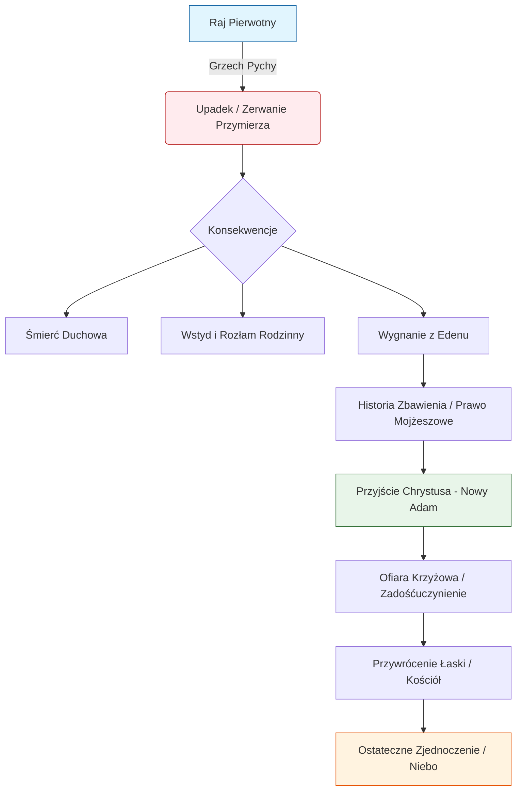

# 5.3 Poziom 12 – Grzech Pierworodny i Upadek

## Wstęp ontologiczny i teologiczny

Grzech Pierworodny stanowi fundamentalny punkt zwrotny w historii zbawienia ludzkości, oznaczający przejście od stanu pierwotnej sprawiedliwości i świętości (stan *iustitia originalis*) do stanu natury zranionej, pozbawionej darów nadprzyrodzonych. W niniejszym opracowaniu analizie poddano ten event nie tylko przez pryzmat teologii dogmatycznej, ale również w kontekście czterech fundamentów prawnych: Prawa Boskiego, Prawa Naturalnego, Prawa Rodowego oraz Prawa Osobowego. Upadek człowieka nie był jedynie aktem nieposłuszeństwa moralnego, lecz katastrofą ontologiczną, która zachwiała podstawami ładu wszechświata, relacji międzyosobowych oraz struktury władzy w rodzinie i społeczeństwie.

---

## 5.3.1 Drzewo Poznania Dobra i Zła – granica wolności

### I. Symbolika i rzeczywistość Drzewa

Drzewo Poznania Dobra i Zła (*Arbor Scientiae Boni et Mali*), umiejscowione w centrum Ogrodu Eden, nie było zwykłą rośliną, lecz sakramentalnym znakiem granicy między stwórczością Boga a autonomią stworzenia. W świetle **Prawa Boskiego**, istnienie tego drzewa było wyrazem suwerenności Stwórcy. Bóg, będąc absolutnym Panem bytu, zastrzegł sobie prawo do definiowania dobra i zła. Człowiek, jako obraz Boga, posiadał wolność, jednak była to wolność *skierowana* – miała prowadzić do pełniejszego zjednoczenia z Źródłem, a nie do uniezależnienia się od Niego.

W kontekście **Prawa Naturalnego**, drzewo to stanowiło obiektywny marker porządku moralnego wpisanego w strukturę rzeczywistości. Zakaz spożycia owocu nie był arbitralnym kaprysem, lecz ochronną barierą dla istoty ludzkiej, która w swoim ograniczonym rozumieniu nie była jeszcze zdolna do samodzielного dźwigania ciężaru ostatecznego osądu moralnego bez odniesienia do Prawodawcy.

### II. Granica wolności w prawie osobowym i rodowym

Z perspektywy **Prawa Osobowego**, istnienie zakazu było warunkiem koniecznym do zaistnienia prawdziwej miłości. Miłość, by być autentyczną, musi wybierać dobrowolnie; gdyby nie było możliwości wyboru zła (przekroczenia granicy), cnota posłuszeństwa i zaufania byłaby niemożliwa. Drzewo zatem było "próbą wiary" dla osoby ludzkiej.

W wymiarze **Prawa Rodowego**, Drzewo Poznania stanowiło centralny punkt przymierza rodzinnego. Adam i Ewa, jako pierwsza wspólnota rodzinna, mieli wspólnie strzec tej granicy. Odpowiedzialność za utrzymanie porządku w Rodzie spoczywała na obojgu małżonkach. Naruszenie tego zakazu przez jednego z nich miało charakter infekcji, która przeniosła się na całą naturę ludzką, skażając dziedzictwo przekazywane potomnym.

### Tabela 1: Atrybuty Drzewa Poznania w czterech porządkach prawnych

| Porządek Prawny | Funkcja Drzewa | Konsekwencja Naruszenia |
| :--- | :--- | :--- |
| **Prawo Boskie** | Znak suwerenności Boga i Jego prawa stanowienia | Utrata łaski uświęcającej, śmierć duchowa |
| **Prawo Naturalne** | Obiektywna granica ludzkiego poznania i działania | Zachwianie równowagi psychiczno-fizycznej, cierpienie |
| **Prawo Rodowe** | Fundament jedności i wspólnego posłuszeństwa małżonków | Rozpad jedności małżeńskiej, wstyd, ukrywanie się |
| **Prawo Osobowe** | Warunek wolnego aktu miłości i zaufania | Utrata wewnętrznej integralności, rozdarcie sumienia |

---

## 5.3.2 Kuszenie – rola węża i utrata zaufania

### I. Ontologia zła i strategia kusiciela

Kuszenie, opisane w Księdze Rodzaju (Rdz 3, 1-5), wprowadza na scenę zbawienia postać węża, identyfikowanego w tradycji chrześcijańskiej z Szatanem – upadłym aniołem. Wąż nie stwarza zła, lecz wykorzystuje istniejącą możliwość nadużycia wolności. Jego strategia opiera się na trzech filarach, które stanowią zaprzeczenie Prawa Bożego i Naturalnego:

1.  **Podważenie Prawdy (Sceptycyzm):** "Czy rzeczywiście Bóg powiedział...?" – wątpliwość co do dobroci i prawdomówności Stwórcy.
2.  **Zaprzeczenie Konsekwencjom (Iluzja bezpieczeństwa):** "Na pewno nie umrzecie" – fałszywa obietnica bezkarności.
3.  **Fałszywa Transcendencja (Pycha):** "Będziecie jak Bóg" – propozycja błogosławieństwa osiągniętego drogą buntu, a nie daru.

### II. Utrata zaufania w świetle Prawa Osobowego

Z perspektywy **Prawa Osobowego**, kuszenie było atakiem na relację zaufania między osobą ludzką a Osobą Boga. Zaufanie jest fundamentem każdej relacji międzyludzkiej i bosko-ludzkiej. Wąż zasugerował, że Bóg jest konkurentem człowieka, a nie jego Ojcem. Ta zmiana paradygmatu – z synostwa na niewolniczy lęk przed rywalem – doprowadziła do alienacji osoby. Człowiek przestał widzieć w Bogu źródło życia, a zaczął postrzegać Go jako ograniczenie swojej autonomii.

### III. Rola Ewy i Adama w dynamice kuszenia

W kontekście **Prawa Rodowego**, mechanizm upadku ujawnia zaburzenie ról w pierwszej rodzinie:
*   **Ewa (Zasada Żeńska):** Uległa sugestii, że dobroć pochodzi z zewnętrznych obiektów (owoc), a nie z relacji z Bogiem. Jej błąd polegał na szukaniu mądrości poza źródłem Mądrości.
*   **Adam (Zasada Męska):** Jako głowa rodziny, Adam biernie przyjął owoc od żony, nie podejmując roli obrońcy Prawa Bożego i stróża porządku w Rodzie. Jego milcząca zgoda była aktem zdrady swojego powołania do przewodnictwa w prawdzie.

> **Analiza fachowa:** Kuszenie nie było atakiem na słabość intelektualną, lecz na wolę. Człowiek wiedział (intelekt), że przekroczenie zakazu jest złe, ale wola, kierowana pychą i pożądliwością oczu, wybrała autonomię kosztem relacji. Jest to klasyczny przykład *non serviam* – odmowy służby, która jest istotą grzechu.

---

## 5.3.3 Upadek – zerwanie przymierza i konsekwencje

### I. Istota grzechu pierworodnego

Grzech pierworodny jest aktem radykalnego zerwania przymierza z Bogiem. W terminologii prawnej jest to **naruszenie kontraktu fundacyjnego** między Stwórcą a stworzeniem. Człowiek, zamiast przyjąć życie jako dar (Prawo Boskie), postanowił je "ukraść" i zawłaszczyć na własnych warunkach.

Skutki tego aktu były natychmiastowe i wielowymiarowe:
1.  **Śmierć duchowa:** Utrata łaski uświęcającej, czyli nadprzyrodzonego życia Bożego w duszy.
2.  **Zaciemnienie rozumu:** Intelekt ludzki utracił jasność widzenia prawd nadprzyrodzonych i nawet naturalnych (błędy w osądzie).
3.  **Osłabienie woli:** Wola stała się skłonna do zła (*concupiscentia*), tracąc panowanie nad popędami.
4.  **Umrartelnienie ciała:** Ciało, wcześniej poddane duszy, stało się podmiotem cierpienia i śmierci fizycznej.

### II. Analiza konsekwencji w czterech porządkach

#### 1. Prawo Boskie: Stan grzechu i potrzeba Odkupienia
Zerwanie przymierza wprowadziło ludzkość w stan długotrwałej niewoli grzechu. Sprawiedliwość Boża domagała się zadośćuczynienia, którego człowiek, będąc stworzeniem skończonym, nie mógł samodzielnie spełnić. Stąd konieczność interwencji Boga – Wcielenia Syna Bożego, który jako Bóg-Człowiek mógł zadośćuczynić za nieskończoną obraźliwość grzechu.

#### 2. Prawo Naturalne: Chaos w przyrodzie i psychice
Upadek zachwiał harmonią wpisana w naturę. Relacja człowiek-przyroda zmieniła się z zarządczej na eksploatacyjną ("ziemia będzie ci rodzić ciernie i osty"). Wewnątrz człowieka powstał konflikt między ciałem a duchem, między rozumem a namiętnościami. Jest to źródło wszelkiego ludzkiego cierpienia i niepokoju egzystencjalnego.

#### 3. Prawo Rodowe: Rozpad komunii osób
Natychmiastowym skutkiem grzechu był wstyd ("spostrzegli, że są nadzy") i wzajemne oskarżanie się. Adam obwinia Ewę, Ewa węża. Zaufanie zastąpiła podejrzliwość, jedność – rywalizacja. Męskość i kobiecość, zamiast się uzupełniać, zaczęły być postrzegane jako zagrożenie lub narzędzie manipulacji. Dominacja mężczyzny nad kobietą ("on będzie panował nad tobą") jest skutkiem grzechu, a nie zamysłem Stwórcy, i stanowi zaprzeczenie równości godnościowej osób.

#### 4. Prawo Osobowe: Utrata tożsamości
Człowiek przestał być w pełni sobą. Jego tożsamość, pierwotnie zakorzeniona w byciu "obrazem Boga", została przesłonięta przez fałszywe poczucie autonomii. Osoba ludzka stała się "ja" zamkniętym w sobie, skoncentrowanym na własnym ego, co prowadzi do samotności mimo obecności innych.

### Tabela 2: Skutki Upadku a Przywrócenie Łaski

| Obszar | Stan przed Upadkiem | Stan po Upadku (Natura zraniona) | Stan po Odkupieniu (Łaska przywracająca) |
| :--- | :--- | :--- | :--- |
| **Relacja z Bogiem** | Przyjaźń, bezpośrednia łączność | Lęk, ucieczka, wrogość | Adoptowane synostwo przez Chrystusa |
| **Relacja z samym sobą** | Wewnętrzny pokój, integralność | Konflikt, wstyd, rozdarcie | Pokój Chrystusowy, walka duchowa |
| **Relacja z innymi** | Jedność, dar z siebie | Wykorzystywanie, dominacja | Komunia, służba, przebaczenie |
| **Relacja ze światem** | Ogrodnictwo, opieka | Eksploatacja, lęk przed naturą | Sakramentalne widzenie świata |

---

## 5.3.4 Wygnanie z Edenu – początek historii zbawienia

### I. Paradoks miłosierdzia w wygnaniu

Wygnanie z Raju (Rdz 3, 23-24) często mylnie interpretowane jest wyłącznie jako kara. W głębszej analizie teologicznej i prawnej jest ono aktem **Bożego Miłosierdzia**. Bóg wypędza człowieka z Edenu, aby ten "nie wyciągnął ręki swej i nie zerwał także z drzewa życia, aby żył na wieki" w stanie grzechu.

Gdyby człowiek pozostał w Raju i spożył owoc z Drzewa Życia w stanie upadku, jego grzech stałby się wieczny i nieodwracalny. Śmierć fizyczna, będąca konsekwencją wygnania, staje się bramą do możliwego oczyszczenia i nowego życia. W tym sensie wygnanie jest pierwszym aktem "terapii" zbawczej, mającej na celu przygotowanie ludzkości na przyjście Odkupiciela.

### II. Historia zbawienia jako proces restytucji prawa

Od momentu wygnania rozpoczyna się historia, którą można opisać jako wieloletni proces sądowo-zbawczy, mający na celu przywrócenie ładu we wszystkich czterech porządkach:

1.  **Stare Przymierze (Prawo Mojżeszowe):** Bóg daje Izraelowi Prawo (Dekalog), które jest pedagogią prowadzącą do uznania grzechu i potrzeby Zbawiciela. Jest to próba uregulowania życia społecznego i religijnego w warunkach upadłej natury.
2.  **Prorocy i Zapowiedź:** Prorocy wskazują na konieczność zmiany serca (Nowe Przymierze), a nie tylko zewnętrznej zgodności z prawem.
3.  **Pełnia Czasów (Chrystus):** Jezus Chrystus, jako "Nowy Adam", приходит przywrócić utracone dary. Przez swoją Mękę, Śmierć i Zmartwychwstanie:
    *   Naprawia zerwanie z Bogiem (Ofiara Krzyżowa).
    *   Przywraca godność osobową (Zmartwychwstanie).
    *   Uzdrowuje relacje rodzinne (powierzenie Jana Maryi).
    *   Otwiera bramy Nieba (Wniebowstąpienie).

### III. Eschatologiczny wymiar powrotu

Wygnanie z Edenu nosi w sobie tęsknotę za powrotem. Cała duchowość chrześcijańska jest pielgrzymowaniem z "doliny płaczu" z powrotem do "Ogrodu", który jednak zostanie przemieniony w "Miasto Święte – Nowe Jeruzalem". Nie jest to powrót do naiwnej niewinności dziecięcej, ale wejście w dojrzałą świętość tych, którzy zostali wypróbowani i oczyszczeni.

W kontekście **Prawa Rodowego**, historia zbawienia to dzieje przywracania właściwej roli Ojca, Matki i Dziecka w Boskim planie. Maria, jako "Nowa Ewa", poprzez swoje posłuszeństwo ("Fiat") odwraca skutki nieposłuszeństwa Ewy. Józef, jako opiekun, restauruje autorytet ojcostwa. Jezus, jako posłuszny Syn, naprawia bunt pierwszego Adama.

### Diagram: Dynamika Upadku i Zbawienia

---

## Zastosowanie praktyczne w życiu współczesnego Rodu

Zrozumienie mechanizmu Grzechu Pierworodnego jest kluczowe dla współczesnych rodzin i jednostek, które zmagają się z skutkami upadłej natury.

1.  **Diagnoza konfliktów:** Większość problemów małżeńskich i rodzinnych (brak zaufania, walka o władzę, wstyd) ma swoje źródło w dynamice upadku opisywanej w Rdz 3. Świadomość tego faktu pozwala oddzielić osobę od problemu i skierować wysiłki ku uzdrowieniu, a nie wzajemnemu obwinianiu.
2.  **Rola pokuty i przebaczenia:** Ponieważ grzech zranił relacje, ich naprawa wymaga aktów pokuty i przebaczenia, które naśladują Boże miłosierdzie. Rodzina musi stać się "szkołą przebaczenia".
3.  **Ochrona granic (Drzewo Poznania):** Współcześni rodzice muszą uczyć dzieci szacunku dla obiektywnych granic moralnych (Prawo Naturalne i Boskie), tłumacząc, że są one wyrazem miłości i ochrony, a nie ograniczenia wolności.
4.  **Walka z pokusą:** Rozpoznanie strategii kusiciela (kwestionowanie prawdy, bagatelizowanie grzechu, obiecywanie fałszywej wolności) jest niezbędne w formacji duchowej dzieci i młodzieży.

---

## Modlitwa o przywrócenie ładu po upadku

*Panie Boże, Stwórco i Ojcze wszystkiego,*
*uznajemy, że przez grzech naszych prarodziców utraciliśmy dar Twojej przyjaźni i wprowadziliśmy zamęt w nasze serca i rodziny.*
*Przez wstawiennictwo Najświętszej Maryi Panny, Nowej Ewy, oraz św. Józefa, Strażnika Odkupiciela,*
*błagamy o przywrócenie ładu w naszym rodzie.*
*Uzdrów naszą pamięć z traumy odrzucenia i wstydu.*
*Naucz nas na nowo ufać Twojemu Słowu i strzec granic, które wyznaczyłeś dla naszego dobra.*
*Niech Twoje Prawo Boskie, Naturalne, Rodowe i Osobowe stanie się ponownie fundamentem naszego życia.*
*Przez Chrystusa Pana naszego, który żyje i króluje na wieki wieków.*
*Amen.*

---

## Deklaracja wierności Prawu Bożemu

"My, członkowie Rodu [Nazwisko/Wspólnota], świadomi skutków Grzechu Pierworodnego i naszej własnej skłonności do buntu, składamy dziś uroczyste zobowiązanie:
1.  **Wyznajemy**, że Bóg jest jedynym Źródłem Dobra i tylko On ma prawo definiować moralność.
2.  **Odrzucamy** pokusę autonomii absolutnej i fałszywej wolności, która prowadzi do zniszczenia.
3.  **Przyjmujemy** z wdzięcznością granice wyznaczone przez Prawo Boskie i Naturalne jako wyraz Ojcowskiej troski.
4.  **Zobowiązujemy się** do budowania relacji rodzinnych opartych na prawdzie, zaufaniu i wzajemnym darze, przeciwstawiając się kulturze wstydu i oskarżenia.
5.  **Pokładamy nadzieję** wyłącznie w zasługach Jezusa Chrystusa, naszego Odkupiciela, który przywrócił nam godność dzieci Bożych."

---

## Bibliografia i źródła do dalszych studiów

1.  *Pismo Święte Starego i Nowego Testamentu* (szczególnie Rdz 1-3, Rz 5, 1 Kor 15).
2.  Sobór Watykański II, Konstytucja duszpasterska o Kościele w świecie współczesnym *Gaudium et spes*, nr 13 (o grzechu).
3.  Jan Paweł II, *Mężczyzną i niewiastą stworzył ich* (Katechezy o teologii ciała), szczególnie cykl o grzechu pierworodnym.
4.  Benedykt XVI, *Encyklika Spe salvi* (nadzieja w kontekście odkupienia).
5.  Katechizm Kościoła Katolickiego, p. 385-421 (O upadku).
6.  św. Tomasz z Akwinu, *Suma Teologiczna*, I-II, q. 81-85 (O grzechu pierworodnym i jego skutkach).
7.  Joseph Ratzinger, *Wiara i przyszłość* (rozważania o eschatologii).
8.  Dokumenty Papieskiej Rady ds. Rodziny dotyczące teologii rodziny.

---

*Opracowanie przygotowano w ramach projektu systematyzacji wiedzy o Prawie Boskim, Naturalnym, Rodowym i Osobowym. Tekst służy formacji duchowej, studiom teologicznym oraz pracy nad odbudową ładu w rodzinach chrześcijańskich.*
