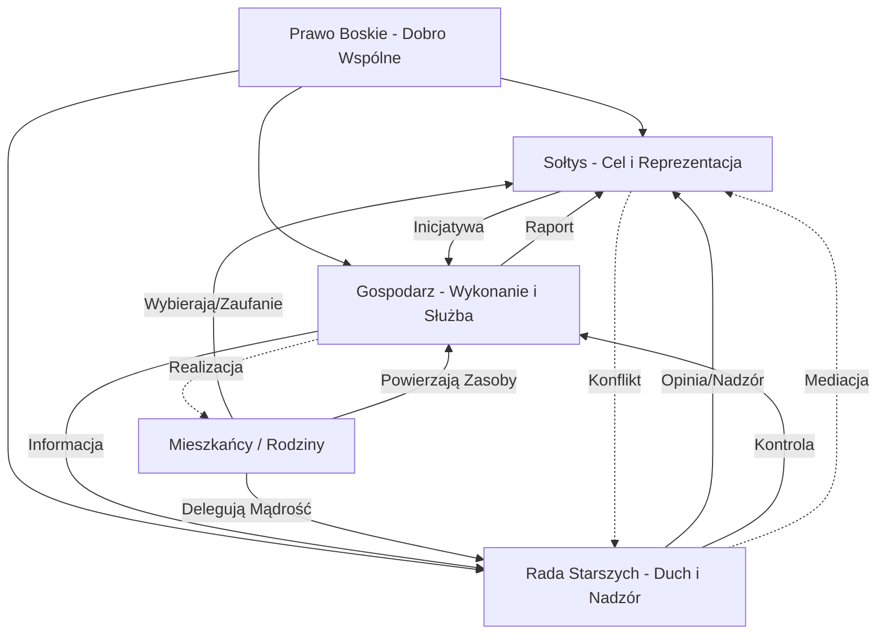

# 6.5 Władza Wspólnot Lokalnych i Sąsiedzkich

## Wstęp: Ontologia Wspólnoty Sąsiedzkiej

Władza wspólnot lokalnych i sąsiedzkich stanowi fundamentalny pomost między intymną sferą rodziny a zinstytucjonalizowaną strukturą państwa. W hierarchii porządku prawnego – od prawa boskiego, przez naturalne, rodowe, aż po osobowe – wspólnota sąsiedzka zajmuje miejsce organicznego wykwitu ludzkiej socjalności. Nie jest ona sztucznym tworem administracyjnym, lecz naturalną konsekwencją zamieszkiwania określonego terytorium przez grupy rodzinne, które wchodzą w relacje wzajemnej zależności, pomocy i odpowiedzialności.

W świetle prawa boskiego, wspólnota lokalna odzwierciedla aspekt trynitarny w wymiarze horyzontalnym: tak jak Trójca Święta jest jednością w różnorodności Osób, tak wspólnota sąsiedzka tworzy jedność celu i dobra wspólnego przy zachowaniu odrębności poszczególnych rodzin i osób. Prawo naturalne nakazuje człowiekowi życie w społeczeństwie (*animal sociale*), a najbliższym środowiskiem realizacji tej natury jest właśnie sąsiedztwo. Prawo rodowe rozszerza się tu poza więzy krwi, tworząc „rodzinę miejsca", zaś prawo osobowe nadaje tym relacjom ramy prawne, szanując godność i podmiotowość każdego mieszkańca.

Niniejszy podrozdział definiuje strukturę władzy we wspólnotach lokalnych, opierając ją na modelu triarchicznym, który zapewnia równowagę między reprezentacją celów wyższych (dobro wspólne), nadzorem moralnym (sumienie społeczności) a realizacją zadań bieżących (gospodarowanie przestrzenią).

---

## 6.5.1 Sołtys / Przedstawiciel Wspólnoty – Władza Reprezentatywna i Celu

### Natura Funkcji
Sołtys (w skali mikro: przedstawiciel bloku, osiedla czy ulicy) pełni funkcję analogiczną do Boga Ojca w Trójcy Świętej oraz głowy rodziny w prawie rodowym. Jest on uosobieniem tożsamości wspólnoty, jej głosem na zewnątrz i strażnikiem długofalowych celów rozwoju lokalnego. Jego władza nie wynika z przymusu administracyjnego, lecz z mandatu zaufania udzielonego przez mieszkańców, co jest wyrazem wolności woli (prawo osobowe) połączonej z naturalną potrzebą przywództwa.

### Podstawy Prawne i Moralne
1.  **Prawo Boskie:** Sołtys powołany jest na wzór ojcostwa duchowego. Jego zadaniem jest dbanie o to, by wspólnota zmierzała ku dobru, prawdzie i pięknu. Jest on inicjatorem dzieł, które przekraczają doraźne potrzeby, budując trwały dorobek pokoleń.
2.  **Prawo Naturalne:** Jako naturalny lider, sołtys wyłania się ze społeczności dzięki swoim cnutom: roztropności, sprawiedliwości, umiarkowaniu i męstwu. Jego autorytet opiera się na uznaniu innych dla jego zdolności do wskazywania właściwego kierunku.
3.  **Prawo Rodowe:** Rozszerza ochronę i troskę ojca rodziny na wszystkie „rodziny" wchodzące w skład wspólnoty. Dba o bezpieczeństwo terytorialne, porządek przestrzenny i dobre imię sąsiedztwa.
4.  **Prawo Osobowe:** Działa jako pełnomocnik wspólnoty, posiadając umocowanie do reprezentowania jej interesów przed władzami państwowymi, osobami prawnymi i innymi podmiotami.

### Zakres Kompetencji
*   **Reprezentacja Zewnętrzna:** Występowanie w imieniu wspólnoty w urzędach gminy, przed sądami, w relacjach z inwestorami i mediami.
*   **Inicjatywa Lokalna:** Wnioskowanie o inwestycje (remonty dróg, oświetlenie, place zabaw), organizację wydarzeń kulturalnych i integracyjnych.
*   **Arbitraż Konfliktów:** Pierwsza instancja w rozwiązywaniu sporów sąsiedzkich (hałas, granice działek, uciążliwe zachowania) zanim trafią one na drogę sądową lub policyjną.
*   **Zarządzanie Kryzysowe:** Koordynacja działań w sytuacjach nagłych (powódź, pożar, awaria) do czasu przybycia służb państwowych.

### Odpowiedzialność i Rozliczalność
Sołtys odpowiada przede wszystkim przed Bogiem (sumienie) i przed wspólnotą (zgromadzenie mieszkańców). Jego kadencja może zostać zakończona przez odwołanie w przypadku utraty zaufania, rażącego naruszenia prawa boskiego lub naturalnego (np. działanie na szkodę wspólnoty, kłamstwo, kradzież mienia wspólnego).

**Tabela 6.5.1: Atrybuty Władzy Sołtysa**

| Poziom Prawa | Źródło Władzy | Główny Cel | Sankcja za Nadużycie |
| :--- | :--- | :--- | :--- |
| **Boskie** | Łaska i powołanie | Dobro duchowe i materialne wspólnoty | Utrata autorytetu, potępienie moralne |
| **Naturalne** | Cnoty i zdolności przywódcze | Rozwój i harmonia sąsiedzka | Izolacja społeczna, utrata szacunku |
| **Rodowe** | Zaufanie „ojców rodzin" | Bezpieczeństwo i prestiż miejsca | Wykluczenie z kręgu zaufanych |
| **Osobowe** | Mandat wyborczy / Pełnomocnictwo | Realizacja woli mieszkańców | Odwołanie, odpowiedzialność cywilna |

---

## 6.5.2 Rada Starszych / Komisja Sąsiedzka – Władza Nadzorcza i Duchowa

### Natura Funkcji
Rada Starszych (lub Komisja Sąsiedzka) pełni rolę analogiczną do Ducha Świętego oraz funkcji matki/żony w prawie rodowym. Jest to organ kolegialny, stanowiący „sumienie wspólnoty". Jej zadaniem nie jest bieżące zarządzanie, lecz nadzór nad zgodnością działań sołtysa i mieszkańców z przyjętymi normami moralnymi, tradycją lokalną oraz zasadami współżycia społecznego. Reprezentuje ona pamięć miejsca, ciągłość pokoleniową i etyczny wymiar życia wspólnotowego.

### Podstawy Prawne i Moralne
1.  **Prawo Boskie:** Rada działa w inspiracji Ducha Prawdy. Jej rolą jest przypominanie o wyższych wartościach, łagodzenie obyczajów i dbanie o to, by relacje sąsiedzkie opierały się na miłości bliźniego i przebaczeniu.
2.  **Prawo Naturalne:** Opiera się na mądrości życiowej i doświadczeniu. Członkowie Rady to osoby, które przetrwały różne próby historyczne i lokalne, posiadając wiedzę o tym, co szkodzi, a co służy trwałości społeczności.
3.  **Prawo Rodowe:** Chroni tradycję rodzinną i lokalną. Dba o to, by nowe zwyczaje nie niszczyły tkanki moralnej społeczności. Pełni funkcję wychowawczą wobec młodszych pokoleń mieszkańców.
4.  **Prawo Osobowe:** Stanowi organ kontrolny powołany statutem wspólnoty. Posiada prawo weta w sprawach dotyczących zmian w charakterze zabudowy czy zasadach współżycia, jeśli naruszają one prawa osobiste mieszkańców.

### Zakres Kompetencji
*   **Nadzór Moralny:** Opiniowanie działań sołtysa pod kątem ich zgodności z dobrem wspólnym i etyką chrześcijańską/społeczną.
*   **Mediacja i Pojednawstwo:** Aktywne uczestnictwo w rozwiązywaniu głębokich konfliktów sąsiedzkich, proponowanie aktów pojednania i zadośćuczynienia.
*   **Ochrona Tradycji:** Piecza nad lokalnymi świętami, rocznicami, dbałość o zieleń i miejsca pamięci.
*   **Kontrola Finansowa:** Przeglądanie rozliczeń finansowych wspólnoty (składki, dotacje) pod kątem uczciwości i celowości wydatków.
*   **Weto Społeczne:** Możliwość zablokowania inicjatyw, które choć formalnie legalne, są szkodliwe dla spójności społeczności (np. sprzedaż gruntu pod uciążliwy obiekt).

### Relacja z Sołtysem
Relacja między Sołtysem a Radą Starszych ma charakter komplementarny, akin do relacji mąż-żona. Sołtys proponuje i działa (inicjatywa), Rada rozważa i strzeże (roztropność). Konflikt między nimi nie powinien prowadzić do paraliżu, lecz do głębszej refleksji nad słusznością obranego kierunku. Rada nie zarządza, ale „tchnie ducha" w działania administracyjne.

**Tabela 6.5.2: Obszary Nadzoru Rady Starszych**

| Obszar Działania | Kryterium Oceny (Prawo Naturalne) | Kryterium Oceny (Prawo Boskie) | Instrument Oddziaływania |
| :--- | :--- | :--- | :--- |
| **Inwestycje** | Celowość, trwałość, estetyka | Czy służy chwale Boga i dobru ludzi? | Opinia, rekomendacja, sprzeciw |
| **Konflikty** | Sprawiedliwość, proporcjonalność | Miłosierdzie, przebaczenie | Mediacja, modlitwa, apel |
| **Finanse** | Uczciwość, transparentność | Uczciwość wobec Boga i ludzi | Audyt społeczny, raport |
| **Zwyczaje** | Szacunek dla starszych, integracja | Wierność tradycji, pobożność | Organizacja eventów, nauka |

---

## 6.5.3 Gospodarz / Administrator Zasobów – Władza Wykonawcza i Techniczna

### Natura Funkcji
Gospodarz (często tożsamy z funkcją administratora nieruchomości, skarbnika lub przewodniczącego zespołu roboczego) pełni rolę analogiczną do Syna Bożego – Sługi, który przyszedł, aby służyć, oraz wykonawcy woli ojca w prawie rodowym. Jest to władza techniczna, operacyjna, skupiona na materii, infrastrukturze i codziennym funkcjonowaniu wspólnoty. To on przekazuje słowa i decyzje w czyny, dbając o konkretny wymiar rzeczywistości.

### Podstawy Prawne i Moralne
1.  **Prawo Boskie:** Naśladuje Chrystusa umywającego nogi uczniom. Jego władza jest służbą (*servant leadership*). Poprzez pracę nad dobrem wspólnym (naprawa drogi, koszenie trawy, sprzątanie) oddaje chwałę Stwórcy, porządkując świat materialny.
2.  **Prawo Naturalne:** Wykorzystuje rozum praktyczny i umiejętności techniczne do efektywnego gospodarowania zasobami. Dba o higienę, bezpieczeństwo i funkcjonalność przestrzeni wspólnej.
3.  **Prawo Rodowe:** Traktuje mienie wspólne jak domowe. Naprawia, konserwuje i pomnaża zasoby powierzone mu przez „ojców rodzin" (mieszkańców).
4.  **Prawo Osobowe:** Działa na podstawie umowy cywilnoprawnej lub powołania. Odpowiada za powierzone mienie i środki finansowe. Jego działania muszą respektować własność prywatną i prawa nabyte poszczególnych osób.

### Zakres Kompetencji
*   **Zarządzanie Infrastrukturą:** Bieżąca konserwacja dróg, chodników, oświetlenia, zieleni, placów zabaw i budynków wspólnych.
*   **Gospodarka Odpadami:** Organizacja wywozu śmieci, segregacji, dbałość o czystość terenu.
*   **Realizacja Budżetu:** Pobieranie składek, opłacanie faktur, zakup materiałów do napraw, prowadzenie księgowości wspólnoty.
*   **Organizacja Pracy Społecznej:** Mobilizowanie mieszkańców do czynów społecznych (szarwark, sprzątanie świata),分配 zadań i nadzór nad ich wykonaniem.
*   **Bezpieczeństwo Techniczne:** Monitorowanie zagrożeń (np. powalone drzewa, dziury w jezdni) i ich szybkie usuwanie.

### Etyka Służby
Gospodarz musi cechować się sumiennością, pracowitością i uczciwością. Jego pokusa polega na biurokratyzacji, przywłaszczaniu środków lub faworyzowaniu niektórych mieszkańców w dostępie do usług. Odpowiada bezpośrednio przed Sołtysem (za realizację celów) i Radą Starszych (za sposób wydatkowania środków).

**Tabela 6.5.3: Zadania Operacyjne Gospodarza**

| Kategoria Zadania | Działanie Konkretne | Podstawa Prawna | Wymóg Etyczny |
| :--- | :--- | :--- | :--- |
| **Utrzymanie Czystości** | Wywóz odpadów, mycie nawierzchni | Regulamin porządkowy | Dbaość o zdrowie publiczne |
| **Remonty** | Łatanie dziur, malowanie, naprawy | Uchwała wspólnoty | Solidność, terminowość |
| **Finanse** | Ściąganie należności, płatności | Umowa/Budżet | Przejrzystość, rzetelność |
| **Logistyka** | Zakup materiałów, wynajem sprzętu | Decyzja Sołtysa | Oszczędność, roztropność |

---

## Triarchia Wspólnoty Lokalnej: Synteza i Dynamika

Władza we wspólnotach lokalnych i sąsiedzkich osiąga swoją pełnię dopiero w prawidłowej współpracy trzech filarów: Sołtysa (Cel), Rady Starszych (Duch/Nadzór) i Gospodarza (Wykonanie). Model ten, zakorzeniony w prawie boskim i naturalnym, zapobiega patologiom władzy:

1.  **Bez Rady Starszych:** Sołtys i Gospodarz mogą popaść w aktywizm bezrefleksyjny, realizujący cele materialne kosztem wartości moralnych i tradycji. Wspólnota staje się korporacją, a nie rodziną.
2.  **Bez Sołtysa:** Rada i Gospodarz pogrążają się w kontemplacji i drobnych naprawach, brakując wizji rozwoju i siły przebicia w świecie zewnętrznym. Wspólnota stagnuje.
3.  **Bez Gospodarza:** Sołtys i Rada pozostają w sferze idei i opinii, podczas gdy rzeczywistość materialna (drogi, czystość) podupada. Wspólnota staje się klubem dyskusyjnym bez wpływu na jakość życia.

### Diagram Interakcji Władzy Lokalnej

### Procedura Rozwiązywania Sporów w Triarchii Lokalnej

W przypadku konfliktu między członkami triarchii lub pomiędzy władzą a mieszkańcami, stosuje się następującą drabinę interwencji, zgodną z zasadą pomocniczości:

1.  **Rozmowa Bezpośrednia:** Strony próbują rozwiązać problem w duchu chrześcijańskim i sąsiedzkim.
2.  **Mediacja Rady Starszych:** Jeśli rozmowa zawiedzie, Rada wkracza jako mediator, przypominając o wartościach i dobrych obyczajach.
3.  **Decyzja Sołtysa:** Po wysłuchaniu głosu Rady i mieszkańców, Sołtys podejmuje ostateczną decyzję w sprawach bieżących i strategicznych.
4.  **Zgromadzenie Wszystkich Mieszkańców:** W sprawach fundamentalnych (zmiana statutu, duże inwestycje, odwołanie władzy) decyduje głos większości kwalifikowanej mieszkańców.
5.  **Interwencja Zewnętrzna:** Dopiero w ostateczności sprawa trafia do władz państwowych (sąd, policja, urząd gminy), co jest uznawane za porażkę mechanizmów samorządnych wspólnoty.

### Modlitwa dla Władz Wspólnoty Lokalnej

> *Panie Boże, Stwórco nieba i ziemi, który powołałeś nas do życia we wspólnocie,*
> *Błogosław naszemu Sołtysowi, aby z mądrością Ojca prowadził nas ku dobru,*
> *Obdarz naszą Radę Starszych Duchem Prawdy, by strzegła naszych serc i tradycji,*
> *I umocnij naszego Gospodarza cierpliwością Syna, by wiernie służył naszym potrzebom.*
> *Spraw, byśmy żyli w zgodzie, pomagając sobie nawzajem,*
> *Czyniąc z naszej miejscowości obraz Twojego Królestwa na ziemi.*
> *Przez Chrystusa, Pana naszego. Amen.*

### Deklaracja Członka Triarchii Lokalnej

> „Ja, niżej podpisany/a, obejmując funkcję we władzach wspólnoty lokalnej, świadomy/a jestem, że moja władza pochodzi od Boga i zaufania moich sąsiadów. Przyrzekam kierować się prawem boskim i naturalnym, stawiać dobro wspólne ponad interesem prywatnym, działać w duchu służby, sprawiedliwości i miłości bliźniego. Zobowiązuję się do szanowania godności każdej osoby, ochrony mienia wspólnego i dbałości o harmonię naszej małej ojczyzny. Tak mi dopomóż Bóg."

---

## Podsumowanie

Władza wspólnot lokalnych i sąsiedzkich jest szkołą demokracji organicznej, wyrastającej z korzeni prawa boskiego i naturalnego. To tutaj człowiek uczy się odpowiedzialności za drugiego, nie będąc do tego zmuszonym kodeksem karnym, lecz własnym sumieniem i więzią sąsiedzką. Properne funkcjonowanie triarchii: Sołtys – Rada Starszych – Gospodarz, zapewnia, że wspólnota rozwija się harmonijnie, łącząc postęp materialny z bogactwem duchowym i społecznym. Jest to fundament, na którym buduje się stabilne państwo i zdrowe społeczeństwo, zgodnie z zasadą, że silne są tylko te narody, których lokalne społeczności są zwarte, sprawiedliwe i wierne.
