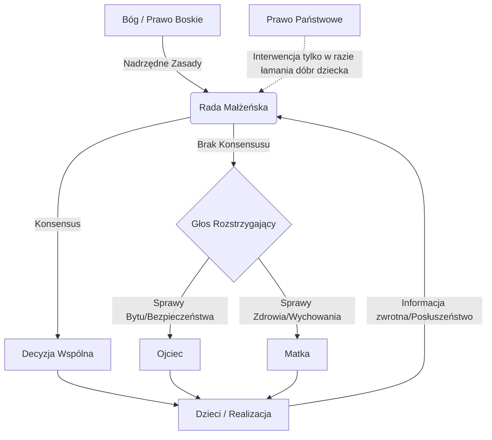

# 6.6 Władza Rodziny

## Wstęp: Rodzina jako fundament ładu prawnego

Rodzina stanowi pierwotną komórkę społeczną, będącą źródłem i wzorcem dla wszystkich innych form władzy opisanych w poprzednich rozdziałach (od władzy boskiej, przez państwową, aż po lokalną). W systemie czterech poziomów prawa – boskiego, naturalnego, rodowego i osobowego – rodzina pełni funkcję kluczowego interfejsu, w którym prawo boskie i naturalne inkarnują się w konkretne relacje międzyludzkie, tworząc grunt pod prawo rodowe i kształtując świadomość prawa osobowego.

Władza w rodzinie nie jest władzą dominacji czy tyranii, lecz władzą służby (*servant leadership*), odpowiedzialności i miłości ofiarnej. Jest to władza derived (pochodna) od Boga, realizowana w wymiarze czasowym poprzez powołanie do ojcostwa i macierzyństwa. Triarchia rodzinna odzwierciedla Trójcę Świętą w mikro-skali: Ojciec (źródło i autorytet), Matka (troska i mądrość relationalna) oraz Dziecko (owoc miłości i podmiot prawa osobowego).

Niniejszy podrozdział definiuje strukturę władzy w rodzinie, zakres kompetencji poszczególnych domowników, mechanizmy podejmowania decyzji oraz relację rodziny do wyższych porządków prawnych.

---

## 6.6.1 Teologiczne i ontologiczne podstawy władzy rodzinnej

### Źródło władzy w prawie boskim
Zgodnie z Prawem Boskim, rodzina jest instytucją ustanowioną bezpośrednio przez Stwórcę ("Dlatego opuści mężczyzna ojca swojego i matkę swoją i złączy się z żoną swoją, i będą jednym ciałem" - Rdz 2,24). Władza rodzicielska nie jest zatem kontraktem społecznym ani przywilejem biologicznym, lecz świętym mandatem (*mandatum divinum*).

1.  **Ojcostwo jako obraz Ojca Niebieskiego**: Ojciec w rodzinie pełni rolę głowy, nie w sensie panowania, ale w sensie source of life and order. Jego władza ma charakter reprezentatywny – reprezentuje on wobec rodziny ład boski, sprawiedliwość i prawdę.
2.  **Macierzyństwo jako obraz Kościoła i Ducha**: Matka wnosi do struktury władzy wymiar życia, pielęgnacji, intuicji duchowej i jednoczenia. Jej autorytet wynika z daru życia i zdolności do kształtowania sumienia dzieci.
3.  **Jedność małżeńska**: Władza w rodzinie jest współdzielona przez małżonków. Rozdzielenie tej władzy lub podporządkowanie jednego małżonka drugiemu w sposób niszczący jego godność jest naruszeniem Prawa Naturalnego.

### Prawo Naturalne a hierarchia w domu
Prawo Naturalne dyktuje, że istota słabsza fizycznie i intelektualnie (dziecko) potrzebuje opieki istoty silniejszej i dojrzalszej (rodzica). Hierarchia w rodzinie wynika z różnicy doświadczenia, odpowiedzialności i obdarowania, a nie z arbitralnej przewagi siły.

*   **Zasada Subsidiarności wewnątrzrodzinnej**: Rodzice powinni wspierać rozwój dziecka, przekazując mu stopniowo odpowiedzialność, aż do momentu uzyskania pełnej samodzielności. Władza rodzicielska wygasa tam, gdzie zaczyna się suwerenność dorosłego dziecka.
*   **Zasada Solidarności**: Członkowie rodziny są zobowiązani do wzajemnego wsparcia w trudnych sytuacjach (choroba, starość, brak pracy). Jest to imperatyw moralny wynikający z krwi i przymierza małżeńskiego.

---

## 6.6.2 Struktura Triarchii Rodzinnej

W modelu władzy rodzinnej wyróżniamy trzy filary, które odpowiadają trzem osobom Boskim, tworząc dynamiczny system równowagi.

### Tabela 6.6.1: Atrybuty władzy w rodzinie

| Filar Władzy | Odpowiednik Osoby Boskiej | Podmiot w Rodzinie | Główny Cel | Źródło Autorytetu | Zakres Kompetencji |
| :--- | :--- | :--- | :--- :--- | :--- |
| **Inicjująca** | Bóg Ojciec | Ojciec / Mąż | Zapewnienie bytu, bezpieczeństwa i kierunku | Przymierze małżeńskie, biologiczne ojcostwo | Reprezentacja zewnętrzna, ostateczne decyzje strategiczne, disciplina |
| **Podtrzymująca** | Duch Święty | Matka / Żona | Budowanie więzi, wychowanie, harmonia emocjonalna | Macierzyństwo, przymierze małżeńskie | Zarządzanie codziennością, edukacja moralna, mediacja konfliktów |
| **Rozwijająca** | Syn Boży | Dziecko | Wzrost, nauka, przygotowanie do dorosłości | Godność osoby ludzkiej (Prawo Osobowe) | Posłuszeństwo (do czasu), nauka, przejmowanie odpowiedzialności |

### 6.6.2.1 Rola Ojca: Strażnik Prawa i Prowidencja
Ojciec jest głównym odpowiedzialnym za materialny i duchowy byt rodziny. Jego władza obejmuje:
*   **Decyzyjność ostateczna**: W przypadku impasu w ważnych sprawach (np. zmiana miejsca zamieszkania, wybór szkoły, крупные wydatki), głos ojca rozstrzyga, jednak musi on być poprzedzony konsultacją z żoną i uwzględnieniem dobra dzieci.
*   **Obrona i Bezpieczeństwo**: Fizyczna i prawna ochrona członków rodziny przed zagrożeniami zewnętrznymi.
*   **Przekaz Tradycji**: Ojciec jest głównym katechetą w domu, przekazuje wzorce męskości, uczciwości i pracowitości.
*   **Karność**: Wymierzanie sprawiedliwości wewnątrz rodziny w przypadku naruszenia zasad, zawsze w duchu wychowawczym, nigdy destrukcyjnym.

### 6.6.2.2 Rola Matki: Serce Domu i Edukatorka Sumienia
Matka sprawuje władzę nad sferą relacji, emocji i codziennego funkcjonowania. Jej kompetencje obejmują:
*   **Zarządzanie zasobami czasu i przestrzeni**: Organizacja życia domowego, rytmu dnia, diety i higieny.
*   **Formacja moralna**: Kształtowanie empatii, wrażliwości na krzywdę innych, wprowadzanie w tajniki relacji międzyludzkich.
*   **Mediacja**: Łagodzenie sporów między ojcem a dziećmi lub między rodzeństwem. Matka często pełni rolę "adwokata" dziecka przed surowością ojca, dbając o sprawiedliwość naprawczą.
*   **Intuicja duchowa**: Często to matka jako pierwsza dostrzega zagrożenia duchowe lub potrzeby rozwoju u dzieci.

### 6.6.2.3 Status Dziecka: Od Podległości do Suwerenności
Dziecko w systemie władzy rodzinnej jest podmiotem szczególnym. Posiada pełną godność (Prawo Osobowe), ale ograniczoną sprawczość (Prawo Rodowe).
*   **Faza zależności (0-13 lat)**: Pełne posłuszeństwo rodzicom. Władza rodzicielska jest absolutna w granicach prawa boskiego i naturalnego.
*   **Faza przygotowawcza (14-18 lat)**: Stopniowe przekazywanie uprawnień decyzyjnych. Młodzież uczestniczy w "radzie rodziny", ucząc się brać odpowiedzialność za wspólne dobro.
*   **Faza emancypacji (18+ lat)**: Przejście z relacji władza-posłuszeństwo w relację partnerską szacunku i doradztwa. Prawo rodowe ustępuje miejsca Prawu Osobowemu dorosłego człowieka.

---

## 6.6.3 Mechanizmy sprawowania władzy i podejmowania decyzji

Władza w rodzinie nie może być sprawowana arbitralnie. Istnieją sprawdzone mechanizmy, które zapewniają ład i pokój domowy.

### Rada Rodzinna (Domowy Sejm)
Regularne spotkania wszystkich pełnoletnich domowników (oraz dzieci w wieku rozumującym) w celu omówienia:
1.  Budżetu domowego i planów finansowych.
2.  Harmonogramu zadań i obowiązków.
3.  Konfliktów i nieporozumień.
4.  Planów wakacyjnych i inwestycyjnych.

Zasada działania: Konsensus jest celem. Jeśli konsensus niemożliwy, decyduje Ojciec po wysłuchaniu głosu Matki i dzieci. Decyzja Ojca może być jednak weto-wana przez Matkę w sprawach dotyczących bezpośredniego bezpieczeństwa lub zdrowia dzieci (mechanizm checks and balances).

### Dyscyplina i Wychowanie
System kar i nagród w rodzinie musi opierać się na prawie naturalnym (zasada przyczynowo-skutkowa).
*   **Kara naturalna**: Skutek bezpośrednio wynikający z czynu (np. zniszczenie zabawki = brak zabawki; brudny pokój = brak wyjścia na zabawę).
*   **Kara umowna**: Ustalona wcześniej za złamanie konkretnego правила (np. godzina policyjna).
*   **Zakaz kar cielesnych upokarzających**: Prawo boskie nakazuje kochać bliźniego. Kara nie może łamać woli dziecka ani niszczyć jego godności. Ma prowadzić do nawrócenia (zmiany postawy), a nie do zemsty rodzica.

### Diagram 6.6.1: Przepływ decyzji w rodzinie

---

## 6.6.4 Relacja Władzy Rodzinnej do innych poziomów prawa

Rodzina nie jest izolowaną wyspą. Jej władza funkcjonuje w kontekście szerszych struktur.

### 6.6.4.1 Rodzina a Prawo Państwowe (Rozdział 6.2)
Państwo posiada władzę subsydiarną względem rodziny. Oznacza to, że:
*   Państwo nie może zastępować rodziców w wychowaniu, chyba że ci rażąco zaniedbują swoje obowiązki (łamstwo Prawa Naturalnego i Boskiego).
*   Podatki i regulacje państwowe nie mogą dusić ekonomicznej zdolności rodziny do utrzymania się.
*   Szkoła i inne instytucje są pomocnicze wobec rodziców, którzy są *pierwszymi i głównymi wychowawcami*.

### 6.6.4.2 Rodzina a Prawo Kościelne/Duchowe (Rozdział 6.1)
Rodzina jest "Kościołem domowym".
*   Władza rodziców obejmuje obowiązek wprowadzania dzieci w życie sakramentalne i modlitwę.
*   Kapłan posiada autorytet duchowy nad rodziną w sprawach wiary, ale nie ingeruje w wewnętrzne zarządzanie majątkiem czy codziennymi sprawami, chyba że został poproszony o radę lub interwencję mediacyjną.

### 6.6.4.3 Rodzina a Prawo Rodowe (Szeroki klan)
W tradycji prawa rodowego, rodzina nuklearna (małżeństwo + dzieci) jest częścią większego rodu.
*   **Rada Starszych Rodu**: Może mieć wpływ na ważne decyzje rodzinne (np. śluby, spadki, konflikty graniczne), działając jako sąd polubowny.
*   **Solidarność rodowa**: Rodzina ma obowiązek pomagać innym członkom rodu w biedzie, ale też ma prawo oczekiwać wsparcia w trudnych chwilach.

---

## 6.6.5 Kryzysy władzy w rodzinie i procedury naprawcze

Gdy struktura władzy w rodzinie ulega zachwianiu, konieczne jest zastosowanie procedur naprawczych zgodnych z prawem naturalnym.

### Scenariusz A: Upadek Autorytetu Ojca
*Objawy:* Bierność, ucieczka w używki, brak zapewnienia bytu, tyrania.
*Reakcja:*
1.  **Napomnienie przez Matkę**: Prywatna rozmowa, wezwanie do opamiętania.
2.  **Interwencja Rady Starszych/Duchownego**: Jeśli małżonkowie nie mogą się dogadać, zewnętrzny autorytet (szanowany członek rodziny lub kapłan) działa jako mediator.
3.  **Przejęcie sterów przez Matkę**: W skrajnych przypadkach niezdolności Ojca, Matka przejmuje funkcję głowy rodziny de facto, działając w trybie awaryjnym dla dobra dzieci, do czasu uzdrowienia sytuacji lub formalnego rozwiązania więzi (jako ostateczność).

### Scenariusz B: Bunt Dzieci i Rozkład Dyscypliny
*Objawy:* Lekceważenie rodziców, agresja, ucieczki z domu.
*Reakcja:*
1.  **Zwołanie Nadzwyczajnej Rady Rodzinnej**: Jasne określenie granic i konsekwencji.
2.  **Sankcje ekonomiczne i wolnościowe**: Ograniczenie dostępu do dóbr (internet, kieszonkowe, wyjścia).
3.  **Wsparcie zewnętrzne**: W przypadku głębokiego kryzysu – terapia rodzinna lub interwencja instytucji pomocy (z zachowaniem ostrożności, by nie oddać władzy wychowawczej w ręce państwa niepotrzebnie).

### Scenariusz C: Konflikt Małżeński (Wojna Domowa)
Gdy Ojciec i Matka stają przeciwko sobie, władza w rodzinie paraliżuje.
*Zasada:* Dobro dzieci jest nadrzędne wobec sporu małżonków.
*Mechanizm:* Tymczasowe zawieszenie sporów, ustalenie "rozejmu wychowawczego", mediacja zewnętrzna. Rozwód jest ostatecznością, gdy dalsze trwanie związku łamie Prawo Naturalne (np. przemoc) i uniemożliwia wypełnianie misji wychowawczej.

---

## 6.6.6 Modlitwa i Akt Powierzenia Władzy Rodzinnej

Aby władza w rodzinie była błogosławiona i skuteczna, powinna być uświęcana modlitwą. Poniżej wzór aktu poświęcenia władzy rodzinnej:

> **Modlitwa o Łaskę Mądrego Sprawowania Władzy w Rodzinie**
>
> "Wszechmogący Boże, Ojcze Niebieski, od którego pochodzi wszelkie ojcostwo i macierzyństwo na ziemi.
> Przed Tobą składamy naszą rodzinę [Imiona członków].
>
> Panie, Ty powierzyłeś nam, rodzicom, władzę nad tymi dziećmi. Wyznajemy, że bez Ciebie nie potrafimy sprawować jej mądrze.
> Daj Ojcu tego domu ducha męstwa, roztropności i sprawiedliwości, aby był tarczą i przewodnikiem, a nie tyranem.
> Daj Matce tego domu ducha miłości, cierpliwości i mądrości, aby była sercem, które leczy rany i buduje jedność.
> Daj dzieciom ducha posłuszeństwa, szacunku i chęci nauki, aby wzrastały w łasce i mądrości.
>
> Niech nasza władza służy dobru, a nie próżności. Niech nasze decyzje będą zgodne z Twoim Prawem Boskim i Naturalnym.
> Gdy błądzimy, popraw nas. Gdy jesteśmy słabi, wspomóż nas. Gdy jesteśmy w konflikcie, pojednaj nas.
>
> Przez Chrystusa Pana naszego, który żyje i króluje z Tobą w jedności Ducha Świętego, Bóg, przez wszystkie wieki wieków. Amen."

---

## 6.6.7 Deklaracja Głowy Rodziny i Współmałżonka

My, niżej podpisani, świadomi naszej roli jako fundamentu społeczeństwa i pierwszej szkoły człowieczeństwa, niniejszym deklarujemy:

1.  **Uznanie Zwierzchnictwa Bożego**: Nasza władza jest pochodna od Boga i będzie przez nas sprawowana w zgodzie z Jego przykazaniami.
2.  **Priorytet Dobra Dziecka**: Wszystkie nasze decyzje będą filtrowane przez pytanie: "Czy to służy zbawieniu i rozwojowi naszych dzieci?".
3.  **Jedność Małżeńska**: Zobowiązujemy się do nierozłączności w działaniach wychowawczych. Nie będziemy podważać autorytetu drugiego małżonka w oczach dzieci.
4.  **Otwartość na Życie i Rodzinę**: Będziemy chronić świętość małżeństwa i otwierać się na nowe życie, zgodnie z naszym powołaniem.
5.  **Odpowiedzialność Społeczna**: Będziemy wychowywać dzieci na ludzi honoru, gotowych do służby w swojej wspólnocie, narodzie i Kościele.

..................................................            ..................................................
*(Podpis Ojca/Głowy Rodziny)*                            *(Podpis Matki/Współmałżonki)*

Data: _______________      Miejsce: _______________

---

## Podsumowanie rozdziału 6.6

Władza w rodzinie jest najważniejszym elementem ładu społecznego. To tutaj, w mikroskali, uczymy się szacunku do autorytetu, odpowiedzialności za drugiego człowieka i sprawiedliwości. Rodzina, która funkcjonuje zgodnie z Prawem Boskim, Naturalnym, Rodowym i Osobowym, staje się bastionem stabilności w zmieniającym się świecie.

Zdecentralizowana, ale zhierarchizowana struktura władzy rodzinnej (Ojciec-Matka-Dziecko) jest modelem dla wszystkich innych instytucji opisanych w rozdziale 6. Państwo, które atakuje władzę rodzicielską, podcina gałąź, na której samo siedzi. Osoba, która nie nauczyła się posłuszeństwa i współpracy w rodzinie, nie będzie dobrym obywatelem ani pracownikiem.

Dlatego odbudowa zdrowej władzy w rodzinie jest warunkiem sine qua non odnowy całego ładu prawnego i społecznego.
