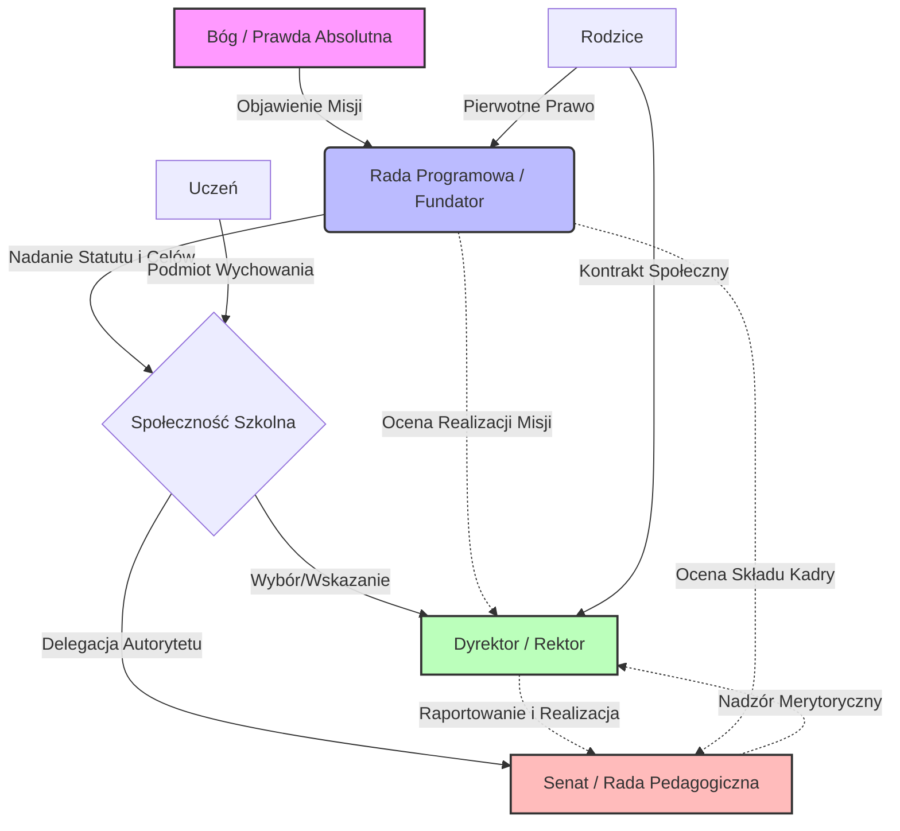

# 6.8 Władza Szkół i Uczelni

## Wstęp: Ontologia Edukacji w Świetle Czterech Poziomów Prawa

Edukacja stanowi fundamentalny proces transmisji dziedzictwa cywilizacyjnego, duchowego i intelektualnego z pokolenia na pokolenie. W ujęciu niniejszej doktryny, szkoła i uczelnia nie są merely instytucjami usługowymi czy fabrykami kadr dla rynku pracy, lecz **świątyniami prawdy**, gdzie dokonuje się spotkanie ludzkiego intelektu z Objawieniem, naturą i tradycją. Władza w szkole i na uczelni ma charakter sakralny – jest władzą nad umysłem i sumieniem wychowanka, co nakłada na sprawujących ją ogromną odpowiedzialność przed Bogiem i historią.

Celem władzy edukacyjnej jest wyprowadzenie człowieka z ciemności niewiedzy ku światłu mądrości (*educere* – wyprowadzić), przy zachowaniu nienaruszalnej godności osoby ludzkiej (*Imago Dei*). Proces ten musi odbywać się w harmonii z czterema poziomami prawa:

1.  **Prawo Boskie**: Nakazuje głoszenie Prawdy, która jest Osobą (Chrystus). Szkoła katolicka lub chrześcijańska ma za zadanie ukazać jedność wiary i rozumu. Żadna wiedza naukowa nie może stać w sprzeczności z prawdami objawionymi, gdyż Bóg jest źródłem wszelkiego poznania.
2.  **Prawo Naturalne**: Wynika z samej natury człowieka jako istoty rozumnej i społecznej. Dziecko ma naturalne prawo do wychowania przez rodziców, a szkoła działa *in loco parentis* (w zastępstwie rodziców), wspierając rozwój cnót intelektualnych (roztropność, wiedza, mądrość) i moralnych.
3.  **Prawo Rodowe (Tradycja)**: Szkoła jest strażnikiem tożsamości narodowej, językowej i kulturowej. Przekazuje mit założycielski narodu, bohaterów, literaturę i historię, kształtując postawę patriotyczną i lojalność wobec wspólnoty przodków.
4.  **Prawo Osobowe**: Respektuje indywidualny talent, tempo nauki i powołanie każdego ucznia. Władza nie może być totalitarna – musi pozostawiać przestrzeń na wolność sumienia i osobisty rozwój charyzmatów.

Władza w oświacie nie jest monopolem państwowym. Zgodnie z zasadą pomocniczości, najważniejsza rola przypada rodzicom, następnie wspólnotom lokalnym, kościołowi, a państwo pełni jedynie rolę subsydiarną – zapewnia ramy prawne i finansowe, nie ingerując w programy ideowe.

---

## 6.8.1 Triarchia Władzy Edukacyjnej

Aby zapobiec degeneracji systemu edukacji w narzędzie indoktrynacji politycznej lub komercyjnej exploatacji, władza w szkole i na uczelni musi być podzielona zgodnie z modelem triarchicznym, odzwierciedlającym Trójcę Świętą. Model ten zapewnia równowagę między wizją duchową, kontrolą merytoryczną a sprawnością organizacyjną.

### Filary Triarchii Edukacyjnej:

| Funkcja | Analogia Teologiczna | Rola w Systemie | Podmiot Sprawujący |
| :--- | :--- | :--- | :--- |
| **Wizja i Duch** | Bóg Ojciec (Źródło) | Określenie celu wychowawczego, misji, etosu szkoły. | **Rada Programowa / Fundator** |
| **Nadzór i Prawda** | Duch Święty (Pamięć/Prawda) | Kontrola zgodności nauczania z prawdą, standardami i tradycją. | **Senat Akademicki / Rada Pedagogiczna** |
| **Realizacja i Służba** | Syn Boży (Sługa/Logos) | Codzienne zarządzanie, organizacja procesu dydaktycznego. | **Dyrektor / Rektor** |

#### 1. Rada Programowa / Fundator (Władza Konstytuująca)
Jest to organ określający „DNA" placówki. To on odpowiada na pytanie: *Dlaczego ta szkoła istnieje?*
*   **Kompetencje:** Ustalanie misji szkoły, wybór patrona, zatwierdzanie statutu w duchu prawa boskiego i rodowego, powoływanie dyrektora/rektora.
*   **Odpowiedzialność:** Przed Bogiem i rodzicami za utrzymanie tożsamości placówki. Jeśli szkoła przestaje realizować swoją misję wychowawczą, Rada ma obowiązek interweniować lub rozwiązać placówkę.
*   **Skład:** Przedstawiciele fundatorów (Kościół, samorząd, stowarzyszenia rodziców), wybitni pedagodzy, duchowni.

#### 2. Senat Akademicki / Rada Pedagogiczna (Władza Stanowiąca/Nadzorcza)
Organ ciał profesorskich/nauczycielskich, dbający o jakość przekazu wiedzy.
*   **Kompetencje:** Zatwierdzanie programów nauczania, nadawanie stopni naukowych/awansów zawodowych, ocena etyki nauczycieli, rozstrzyganie sporów dotyczących ocen i egzaminów.
*   **Odpowiedzialność:** Za merytoryczny poziom edukacji i zgodność z prawdą naukową oraz sumieniem. Chroni uczniów przed pseudonauką i ideologizacją treści.
*   **Zasada działania:** Demokratyzm oparty na autorytecie wiedzy, a nie na liczbie głosów. Decyzje zapadają w oparciu o dyskusję merytoryczną.

#### 3. Dyrektor / Rektor (Władza Wykonawcza)
Sługa społeczności szkolnej, odpowiedzialny za logistykę i atmosferę.
*   **Kompetencje:** Zatrudnianie personelu pomocniczego, zarządzanie budżetem, organizacja czasu lekcyjnego, dbanie o bezpieczeństwo fizyczne, reprezentacja szkoły na zewnątrz.
*   **Odpowiedzialność:** Za sprawne funkcjonowanie placówki, realizację budżetu, bezpieczeństwo uczniów. Nie ma prawa narzucać programu ideowego ani zmieniać ocen wystawionych przez nauczycieli.
*   **Styl przywództwa:** Służebny (*Servant Leadership*). Dyrektor jest pierwszym wśród równych, ułatwiającym pracę nauczycielom.

---

## 6.8.2 Hierarchia Praw w Procesie Edukacyjnym

Proces dydaktyczno-wychowawczy musi być podporządkowany ścisłej hierarchii norm. Konflikt między różnymi poziomami prawa musi być rozstrzygany jednoznacznie na korzyść wyższego dobra.

### Tabela Priorytetów w Edukacji

| Sytuacja Konfliktowa | Rozstrzygnięcie wg Hierarchii Praw | Uzasadnienie |
| :--- | :--- | :--- |
| **Program państwowy vs. Sumienie Rodziców** | Wygrywa Sumienie Rodziców (Prawo Naturalne) | Rodzice są pierwotnymi wychowawcami. Państwo nie może narzucać treści sprzecznych z wiarą lub wartościami rodziny. Możliwość zwolnień lub szkół alternatywnych. |
| **Teoria Naukowa vs. Dogmat Wiary** | Harmonia przez Prawo Boskie i Naturalne | Jeśli teoria jest dobrze udowodniona, nie może przeczyć wierze (Bóg jest Autorzem natury). Jeśli jest to tylko hipoteza ideologiczna (np. gender, materializm), musi być odrzucona lub przedstawiona jako hipotetyczna, z poszanowaniem Prawa Boskiego. |
| **Tradycja Narodowa vs. Globalizm** | Wygrywa Prawo Rodowe | Szkoła ma kształtować obywateli lojalnych wobec swojej ojczyzny. Universalizm nie może wymazywać szczególnej miłości do własnego narodu i jego historii. |
| **Wygoda Ucznia vs. Wymagania** | Wygrywa Dobro Ucznia (Prawo Osobowe w aspekcie rozwoju) | Prawdziwa miłość wymaga wymagania. „Tolerancja" lenistwa jest krzywdą dla dziecka. Władza musi egzekwować dyscyplinę intelektualną. |

### Algorytm Decyzyjny dla Nauczyciela

Gdy nauczyciel staje przed dylematem programowym:
1.  **Czy treść jest zgodna z Prawdą Objawioną?** (Test Prawa Boskiego). Jeśli NIE -> Odrzuć lub skrytykuj.
2.  **Czy treść jest zgodna z faktami naukowymi i logiką?** (Test Prawa Naturalnego). Jeśli NIE -> Odrzuć jako błąd.
3.  **Czy treść szanuje tradycję i kulturę mojego narodu?** (Test Prawa Rodowego). Jeśli NIE -> Skontekstualizuj lub wskaż obcość.
4.  **Czy metoda jest dostosowana do możliwości ucznia?** (Test Prawa Osobowego). Dostosuj środki, ale nie cel.

---

## 6.8.3 Specyfika Poziomów Edukacji

Władza w edukacji przyjmuje różne formy w zależności od etapu rozwoju człowieka.

### A. Szkoła Podstawowa (Formacja Charakteru)
*   **Cel:** Przekazanie podstawowych umiejętności (czytanie, pisanie, liczenie) oraz zaszczepienie nawyków moralnych i posłuszeństwa.
*   **Dominujące Prawo:** Prawo Rodowe i Naturalne. Dziecko uczy się miejsca w rodzinie i społeczeństwie.
*   **Rola Nauczyciela:** Autorytet moralny, figura quasi-rodzicielska. Władza musi być wyraźna, ciepła, ale stanowcza.
*   **Zagrożenia:** Ideologizacja od najmłodszych lat, niszczenie autorytetu dorosłych, promocja relatywizmu.

### B. Szkoła Średnia (Formacja Intelektu i Tożsamości)
*   **Cel:** Rozwój krytycznego myślenia, poznanie historii i kultury, przygotowanie do wyboru drogi życiowej.
*   **Dominujące Prawo:** Prawo Osobowe (odkrywanie powołania) i Rodowe (świadomość historyczna).
*   **Rola Nauczyciela:** Przewodnik, mentor. Władza oparta na dialogu i argumentacji.
*   **Zagrożenia:** Nihilizm, bunt przeciwko tradycji, presja rówieśnicza, manipulacja medialna.

### C. Uczelnia Wyższa (Poszukiwanie Prawdy i Specjalizacja)
*   **Cel:** Tworzenie nowej wiedzy, kształcenie elit intelektualnych i zawodowych, służba dobru wspólnemu.
*   **Dominujące Prawo:** Prawo Boskie (jedność wiary i rozumu) oraz Naturalne (metody badawcze).
*   **Rola Profesora:** Badacz i świadek prawdy. Wolność akademicka nie jest wolnością od prawdy, lecz wolnością do jej szukania.
*   **Zagrożenia:** Korporacjonizm, uzależnienie od grantów ideologicznych, utrata transcendencji, redukcjonizm materialistyczny.

---

## 6.8.4 Mechanizmy Obrony Przed Uzupracją Władzy

Historia zna wiele przykładów, gdy szkoła stawała się narzędziem tyranii (totalitaryzmy XX wieku). Aby temu zapobiec, system musi posiadać wbudowane mechanizmy obronne:

1.  **Subsydiarność Finansowa:** Środki publiczne muszą podążać za uczniem (bon oświatowy), a nie za placówką. Rodzic decyduje, gdzie ulokuje kapitał edukacyjny swojego dziecka, co wymusza na szkołach konkurencję jakością i etosem, a nie biurokratycznym przymusem.
2.  **Prawo do Szkół Alternatywnych:** Pełna swoboda zakładania szkół przez organizacje pozarządowe, kościoły i grupy rodzicielskie bez nadmiernej biurokracji państwowej.
3.  **Klauzula Sumienia dla Nauczyciela:** Gwarancja, że nauczyciel nie może być zmuszony do nauczania treści sprzecznych z jego sumieniem i wiarą pod groźbą utraty pracy.
4.  **Jawność Programów:** Wszystkie podręczniki i materiały dydaktyczne muszą być jawne i dostępne dla rodziców przed rozpoczęciem roku szkolnego.
5.  **Rola Samorządu Uczniowskiego:** Nie jako organu politycznego, lecz szkoły demokracji i odpowiedzialności, uczący szacunku do władzy poprzez współdecydowanie w sprawach bieżących (wyjazdy, imprezy), przy zachowaniu zakazu ingerencji w program nauczania i oceny.

---

## 6.8.5 Duchowość Pracy Nauczyciela

Praca nauczyciela i profesora jest powołaniem (*vocatio*), a nie zawodem. Wymaga ona ciągłego wzrostu duchowego.

### Modlitwa Nauczyciela

> „Panie Jezu, Mistrzu i Nauczycielu wszystkich narodów,
> Ty, który otwierałeś usta niemowląt i mędrców, by głosiły Twoją chwałę,
> Spójrz łaskawie na trud mojej posługi.
> Darz mnie mądrością Salomona, bym umiał dzielić wiedzę,
> Cierpliwością Hioba, bym nie tracił nadziei w obliczu niewiedzy,
> I miłością Ojca Miłosiernego, bym w każdym uczniu widział Twoje Obraz.
>
> Strzeż mnie od pychy intelektualnej i rutyny serca.
> Niech moje słowa będą siewem prawdy,
> A moje życie świadectwem cnót, które głoszę.
> Gdy przyjdzie mi prowadzić młodzież przez labirynty świata,
> Bądź moją Latarnią, bym nikogo nie wprowadził w błąd.
> Powierzam Ci umysły i serca powierzonych mi wychowanków.
> Niech rosną w mądrości, wieku i łasce,
> Ku chwale Twojej i pożytkowi Ojczyzny.
> Amen."

### Deklaracja Nauczyciela Chrześcijańskiego

„Ja, niżej podpisany/a, przyjmując odpowiedzialność za wychowanie młodzieży, zobowiązuję się:
1.  Stawać się wzorem cnót dla moich uczniów.
2.  Nauczać prawdy bez względu na chwilowe trendy polityczne.
3.  Szanować godność każdego ucznia, niezależnie od jego pochodzenia i zdolności.
4.  Wspierać rodziców w ich перворzędnej roli wychowawczej, a nie ich zastępować.
5.  chronić uczniów przed ideologiami destrukcyjnymi dla duszy i ciała.
6.  Pamiętać, że moim ostatecznym Przełożonym jest Bóg, przed którym złożę rachunek z każdej godziny lekcyjnej."

---

## 6.8.6 Podsumowanie: Szkoła jako Fundament Cywilizacji

Władza w szkołach i uczelniach jest kluczem do przyszłości narodu i Kościoła. System edukacji oparty na prawie boskim, naturalnym, rodowym i osobowym produkuje ludzi wolnych, odpowiedzialnych, zakorzenionych w tradycji, a jednocześnie otwartych na prawdę naukową. Jest to antidotum na chaos nowoczesności i relatywizm moralny.

Triarchiczny model zarządzania placówką (Fundator – Senat – Dyrektor) zapewnia stabilność i ochronę przed degeneracją. Szkoła tak zorganizowana nie jest „fabryką", lecz **warsztatem człowieczeństwa**, gdzie pod okiem mistrzów (nauczycieli) i przy wsparciu rodziny, ku chwale Boga, wykuty zostaje nowy obywatel Królestwa Niebieskiego i Rzeczypospolitej.

Investycja w taką edukację jest najwyższym aktem patriotyzmu i wiary. Jak mówi św. Jan Chryzostom: *„Nie ma nic ważniejszego nad wychowanie dzieci, bo od tego zależy los całego świata"*. Dlatego władza edukacyjna musi być sprawowana z największą troską, pokorą i odwagą cywilną.
