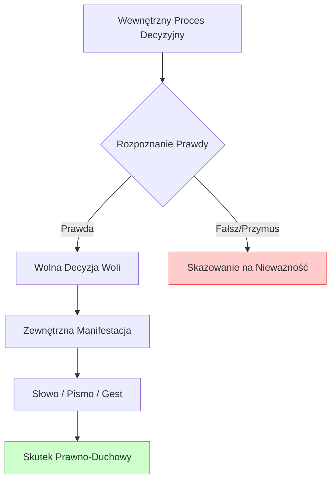

# 8.5 Prawo Naturalne i Oświadczenie Woli

## Wstęp: Ontologia Wolnej Woli w Porządku Stworzonym

Oświadczenie woli jest fundamentalnym aktem ludzkiej osoby, poprzez który wewnętrzny stan ducha, umysłu i serca zostaje zewnętrznie wyrażony, tworząc skutki prawne, moralne i duchowe. W systemie Prawa Wszelakiego akt ten nie jest jedynie formalną czynnością prawną w rozumieniu kodeksu cywilnego, lecz stanowi sakralny moment współtworzenia rzeczywistości przez człowieka, obdarzonego wolną wolą na obraz i podobieństwo Boga.

Niniejszy rozdział analizuje naturę oświadczenia woli przez pryzmat czterech filarów prawa:
1.  **Prawo Boskie:** Źródło wolności i prawdy, które nakłada na słowo ludzkie obowiązek zgodności z rzeczywistością (*veritas*).
2.  **Prawo Naturalne:** Wewnętrzny imperatyw sumienia, kierujący wolą ku dobru wspólnemu i własnemu.
3.  **Prawo Rodowe:** Kontekst dziedziczny i wspólnotowy, w którym dokonywane są najważniejsze decyzje egzystencjalne.
4.  **Prawo Osobowe:** Suwerenność jednostki w dysponowaniu swoim majątkiem, ciałem i duchem, z poszanowaniem granic wyznaczonych przez wyższe porządki prawne.

> *"Niech będzie 'Tak' wasze 'Tak', a 'Nie' waszym 'Nie'. A co nad to jest, od Złego pochodzi."* (Mt 5, 37)

---

## 8.5.1 Teologiczne i Filozoficzne Fundamenty Oświadczenia Woli

### 1. Wolna Wola jako Dar i Obowiązek
Wolna wola (*liberum arbitrium*) jest darem Boga, który pozwala człowiekowi uczestniczyć w akcie stwórczym. Każde oświadczenie woli jest mikrostworzeniem – wprowadzeniem nowej jakości do porządku społecznego i prawnego.
- **Aspekt Boski:** Bóg objawia się jako Słowo (*Logos*). Człowiek, będąc *Imago Dei*, również realizuje się przez słowo i decyzję.
- **Aspekt Naturalny:** Rozum poznaje dobro, a wola dąży do niego. Oświadczenie woli jest zwieńczeniem procesu rozeznania.
- **Aspekt Osobowy:** To dowód na podmiotowość człowieka. Rzeczy nie mają woli; tylko osoba może "oświadczać".

### 2. Zasada Prawdy Materialnej vs. Formalnej
W prawie pozytywnym często dominuje prawda formalna (zgodność z procedurą). W Prawie Wszelakim absolutnym wymogiem jest **prawda materialna**.
- Oświadczenie niezgodne z prawdą (kłamstwo, ukrywanie wad, symulacja) jest nieważne *ab initio* (od początku) w oczach Prawa Boskiego i Naturalnego, nawet jeśli prawo stanowcze nadaje mu skutek.
- **Symulacja:** Pozorne złożenie oświadczenia woli (np. fikcyjna sprzedaż majątku rodowego w celu uniknięcia podatku) jest grzechem przeciwko Osmemu Przykazaniu ("Nie mów fałszywego świadectwa") i naruszeniem Prawa Naturalnego. Skutkuje ono "niewidzialną nieważnością", która wcześniej czy później ujawnia się w postaci chaosu w życiu rodziny lub firmy.

### 3. Sumienie jako Strażnik Woli
Zanim wola zostanie wyrażona na zewnątrz, musi przejść przez filtr sumienia.
- **Sumienie błędnie uformowane:** Może doprowadzić do oświadczenia woli szkodliwego, mimo szczerych intencji.
- **Sumienie dobrze uformowane:** Jest głosem Prawa Naturalnego w sercu człowieka, ostrzegającym przed decyzjami sprzecznymi z godnością osoby i dobrem rodziny.

---

## 8.5.2 Struktura Aktu Oświadczenia Woli

Każde ważne oświadczenie woli w systemie Prawa Wszelakiego musi spełniać cztery warunki integralności:

### Elementy Konstytutywne:
1.  **Intencja (*Animus*):** Świadome chcenie skutku prawnego. Bez intencji nie ma czynności. Działanie w stanie niepoczytalności, pod wpływem silnego emocjonalnego szoku lub przymusu fizycznego (*vis absoluta*) pozbawia akt woli jego istoty.
2.  **Treść:** Musi być możliwa do wykonania, zgodna z Prawem Boskim i Naturalnym oraz oznaczona (określona). Nie można skutecznie oświadczyć woli sprzedaży czegoś, co nie istnieje, lub zobowiązania się do grzechu.
3.  **Forma:** Sposób wyrażenia woli (ustny, pisemny, dorozumiany). Choć forma jest często wymagana dla celów dowodowych (prawo pozytywne), w porządku naturalnym liczy się rzeczywiste wyrażenie zamiaru. Jednakże lekceważenie formy ustanowionej dla ochrony dobra wspólnego (np. forma aktu notarialnego przy zbyciu nieruchomości) jest naruszeniem zasady ostrożności.
4.  **Adresat:** Oświadczenie woli musi być skierowane do innego podmiotu (osoby, Boga, wspólnoty).

### Wady Oświadczenia Woli w Świetle Prawa Wszelakiego:

| Typ Wady | Definicja Prawna | Ocena Moralno-Duchowa | Skutek w Systemie PW |
| :--- | :--- | :--- | :--- |
| **Błąd** | Rozbieżność między wolą a oświadczeniem. | Wynik niedbalstwa intelektualnego lub braku rozeznania. | Nieważność względna; wymóg naprawienia szkody. |
| **Podstęp** | Wywołanie błędu przez drugą stronę. | Grzech oszustwa; złamanie zaufania. | Nieważność bezwzględna; odpowiedzialność karna i duchowa. |
| **Groźba** | Wywołanie lęku celem wymuszenia woli. | Grzech przemocy; naruszenie nietykalności osoby. | Nieważność czynności; obowiązek restytucji. |
| **Symulacja** | Pozorność czynności. | Kłamstwo wobec świata i Boga. | Czynność nieistniejąca; ciężki grzech. |

---

## 8.5.3 Oświadczenie Woli w Życiu Rodowym i Społecznym

Rodzina i wspólnota są naturalnym środowiskiem, w którym dokonywane są najważniejsze oświadczenia woli.

### 1. Zgoda Małżeńska
Jest to najważniejsze oświadczenie woli w życiu osoby fizycznej.
- **Materia:** Wzajemne darowanie się i przyjęcie małżonków.
- **Warunek:** Musi być wolna, świadoma, całkowita i wierna aż do śmierci.
- **Naruszenie:** Wyłączenie z woli płodności, jedności lub nierozerwalności czyni małżeństwo nieważnym w sensie ontologicznym, niezależnie od ceremonii kościelnej czy urzędowej.

### 2. Dyspozycje Majątkowe Rodu
Zbywanie majątku rodowego (nieruchomości, dzieła sztuki, historie ustne) wymaga szczególnego trybu oświadczenia woli:
- **Zasada Subsidiarności:** Decyzja powinna być podejmowana na najniższym możliwym poziomie, ale w konsultacji z głową rodu lub radą rodzinną.
- **Prawo Pierworództwa i Zachowku:** Oświadczenie woli spadkodawcy nie może całkowicie ignorować naturalnych praw potomków do dziedzictwa, chyba że zachodzą przesłanki wydziedziczenia zgodne z Prawem Boskim (ciężkie przewinienia moralne).

### 3. Przymierza i Sojusze
W relacjach międzyludzkich i międzyrodowych oświadczenie woli przybiera formę przysięgi lub przymierza.
- Słowo dane w przymierzu jest wiążące mocą samego faktu jego wypowiedzenia przed Bogiem i świadkami.
- Złamanie takiego słowa jest profanacją Imienia Bożego, jeśli zostało Ono призwane na świadka.

---

## 8.5.4 Granice Autonomii Woli: Kiedy "Chcę" nie znaczy "Mogę"

Prawo Osobowe przyznaje człowiekowi szeroką autonomię, ale nie jest ona absolutna. Istnieją granice, których oświadczenie woli nie może przekroczyć.

### Zakazane Przedmioty Oświadczenia Woli:
1.  **Zrzeczenie się Godności:** Nie można ważnie oświadczyć woli zostania niewolnikiem, przedmiotem handlu lub zrezygnować z prawa do życia. Takie oświadczenia są *null and void* z mocy Prawa Naturalnego.
2.  **Zobowiązanie do Grzechu:** Umowa zobowiązująca do popełnienia czynu zabronionego przez Prawo Boskie (np. zabójstwo, aborcja, kradzież) jest nieważna i nie rodzi żadnych skutków prawnych ani moralnych obowiązku jej wykonania. Wręcz przeciwnie – istnieje moralny obowiązek jej niewykonania.
3.  **Dyspozycja Ciałem w Celach Niemoralnych:** Sprzedaż organów, surogactwo komercyjne czy prostytucja są próbą potraktowania ciała jako towaru, co narusza integralność osoby stworzonej na obraz Boga.
4.  **Naruszenie Praw Rodowych:** Próba jednostronnego zrzeczenia się obowiązków rodzicielskich wobec dzieci jest nieskuteczna w porządku naturalnym, nawet jeśli prawo pozytywne na to pozwala. Obowiązek wychowania wynika z faktu biologicznego i duchowego ojcostwa/macierzyństwa, a nie z umowy.

### Zasada *Neminem laedere* (Nie szkodzić nikomu)
Oświadczenie woli jest ważne tylko wtedy, gdy nie narusza nienaruszalnych praw innych osób. Wolność jednego kończy się tam, gdzie zaczyna się godność drugiego.

---

## 8.5.5 Odpowiedzialność za Słowo i Czyn

W systemie Prawa Wszelakiego każda decyzja pociąga za sobą odpowiedzialność na czterech poziomach:

1.  **Odpowiedzialność Duchowa:** Przed Bogiem. Każde słowo będzie wydane na sąd (Mt 12, 36). Kłamstwo w oświadczeniu woli obciąża sumienie i wymaga sakramentalnej lub osobistej pokuty.
2.  **Odpowiedzialność Moralna:** Wobec własnego sumienia i społeczności. Utrata dobrego imienia (*infamia*) jest naturalną konsekwencją łamania słowa.
3.  **Odpowiedzialność Rodowa:** Wobec rodziny. Złe decyzje majątkowe mogą obciążyć kolejne pokolenia długami lub utratą dziedzictwa.
4.  **Odpowiedzialność Prawna:** Wobec państwa. Sankcje cywilne (odszkodowania) i karne są ziemskim odzwierciedleniem sprawiedliwości, choć często niedoskonałym.

### Restytucja i Naprawa
Jeśli oświadczenie woli spowodowało szkodę (np. przez błąd lub podstęp), sprawca ma święty obowiązek naprawienia szkody (*restitutio in integrum*). Samo przeprosiny nie wystarczą; konieczne jest przywrócenie stanu poprzedniego lub rekompensata.

---

## 8.5.6 Procedura Składania Oświadczenia Woli w Duchu Prawa Wszelakiego

Aby oświadczenie woli było pełne, owocne i zgodne z wyższym porządkiem, zaleca się następujący proces:

### Krok 1: Rachunek Sumienia i Rozeznanie
- Czy moja decyzja jest zgodna z Prawdą?
- Czy nie działam pod wpływem gniewu, chciwości lub lęku?
- Czy konsultowałem sprawę z właściwymi osobami (małżonek, doradca, kapłan)?

### Krok 2: Sformułowanie Intencji
- Jasne określenie celu czynności.
- Upewnienie się, że cel jest dobry i osiągalny.

### Krok 3: Wybór Formy
- Dobranie formy adekwatnej do wagi sprawy (od ustnej obietnicy po akt notarialny).
- W sprawach wagi państwowej lub rodowej – wymóg formy pisemnej ze świadkami.

### Krok 4: Złożenie Oświadczenia
- Wypowiedzenie słów lub podpisanie dokumentu z pełną świadomością.
- Wezwanie Boga na świadka (w sprawach wagi moralnej).

### Krok 5: Dotrzymanie (Fides)
- Wierność złożonemu słowu aż do końca, niezależnie od zmiany okoliczności, chyba że zmiana ta czyni wykonanie niemożliwym lub niemoralnym.

---

## 8.5.7 Studia Przypadków (Case Studies)

### Przypadek A: "Uczciwy Kupiec"
*Sytuacja:* Kupiec sprzedaje ziemię. Wie, że grunt ma ukrytą wadę (skażenie gleby), której nie widać podczas oględzin. Prawo cywilne w danym kraju może pozwalać na milczenie, jeśli kupujący nie pyta.
*Analiza w Prawie Wszelakim:*
- Milczenie kupca w kwestii istotnej wady jest formą podstępu (*dolus*).
- Naruszenie zasady Prawdy Materialnej.
- **Werdykt:** Sprzedaż jest ważna cywilnie, ale nieważna moralnie. Kupiec zaciąga dług moralny i duchowy. Powinien dobrowolnie ujawnić wadę przed finalizacją transakcji lub obniżyć cenę adekwatnie do ryzyka. Zatajenie informacji sprowadza nieszczęście na ród kupującego i sprzedającego.

### Przypadek B: "Przymuszona Spadkobierczyni"
*Sytuacja:* Starsza matka, pod groźbą porzucenia w domu opieki przez dzieci, przepisuje cały majątek na jednego syna.
*Analiza w Prawie Wszelakim:*
- Występuje groźba bezprawna (*metus*), która znosi wolność woli.
- Oświadczenie woli jest pozornie dobrowolne, ale wewnętrznie zniewolone.
- **Werdykt:** Czynność jest nieważna z mocy Prawa Naturalnego. Syn, który wymusił zapis, działa jak złodziej. Rodzina powinna interweniować, by przywrócić sprawiedliwość, nawet kosztem konfliktu z prawem pozytywnym, które mogłoby uznać taki testament za ważny formalnie.

### Przypadek C: "Ślub Małżeński z Wyłączeniem Dzieci"
*Sytuacja:* Para bierze ślub kościelny i cywilny, ale w intencji jedno z nich (lub oboje) postanawia nigdy nie mieć dzieci (*contraceptive mentality* jako stały stan woli).
*Analiza w Prawie Wszelakim:*
- Istota małżeństwa obejmuje otwartość na życie.
- Wyłączenie tego dobra z woli czyni akt małżeński pustym znakiem.
- **Werdykt:** Małżeństwo nie powstało. Żyją w stanie konkubinatu usankcjonowanym pozorami. Wymagane jest uzdrowienie woli i odnowienie zgody małżeńskiej.

---

## 8.5.8 Modlitwa i Deklaracja Osobista

**Modlitwa przed Podjęciem Ważnej Decyzji:**
> "Panie Boże, Dawco Wolności i Prawdy.
> Oświeć mój umysł, abym poznał Twoją wolę w tej sprawie.
> Umacniaj moją wolę, abym nie dał się zwieść namiętnościom, lękowi ani namowom złych ludzi.
> Spraw, by moje słowo było odbiciem Twojego Słowa – twórcze, prawdziwe i wiernne.
> Jeśli ta decyzja ma służyć memu zbawieniu i dobru mojej rodziny – błogosław jej.
> Jeśli ma oddalić mnie od Ciebie – spraw, bym ją zaniechał.
> Przez Chrystusa, Pana naszego. Amen."

**Deklaracja Integralności Słowa:**
> "Ja, [Imię i Nazwisko], oświadczam przed Bogiem, ludźmi i własnym sumieniem, że wszelkie akty woli przeze mnie składane będą wypływały z głębi prawdy, bez podstępu, przymusu i symulacji. Zobowiązuję się do dotrzymania danego słowa, uznając je za święte więzy łączące mnie z drugim człowiekiem i z Bogiem. W razie popełnienia błędu, zobowiązuję się do niezwłocznej naprawy szkody i przywrócenia sprawiedliwości."

---

## Aneks: Checklista Ważności Oświadczenia Woli

Przed złożeniem każdego istotnego oświadczenia woli (umowa, testament, ślub, przysięga), należy odpowiedzieć na pytania:

1.  **Czy znam prawdę?** (Czy posiadam wszystkie fakty? Czy nie ignoruję niewygodnych informacji?)
2.  **Czy jestem wolny?** (Czy nie działam pod wpływem silnych emocji, używek, presji czasu lub gróźb?)
3.  **Czy treść jest moralna?** (Czy przedmiot umowy nie jest sprzeczny z Prawem Boskim i Naturalnym?)
4.  **Czy mam kompetencje?** (Czy prawo mi pozwala rozporządzać tym dobrem? Czy nie naruszam praw innych osób?)
5.  **Czy forma jest odpowiednia?** (Czy wybieram formę, która zapewnia bezpieczeństwo i dowód?)
6.  **Czy jestem gotów ponieść konsekwencje?** (Czy akceptuję ryzyko związane z tą decyzją?)
7.  **Czy konsultowałem to z właściwymi osobami?** (Małżonek, doradca, kapłan, starsi rodu).

Jeśli na którekolwiek z pytań odpowiedź brzmi "NIE" lub "NIE WIEM" – należy wstrzymać się od złożenia oświadczenia woli.

---

## Bibliografia i Źródła

1.  *Katechizm Kościoła Katolickiego*, część III: Życie w Chrystusie (rozdziały o VIII przykazaniu i życiu gospodarczym).
2.  św. Tomasz z Akwinu, *Suma Teologiczna*, I-II, q. 6 (O dobrowolności i mimowolności) oraz q. 94 (O prawie naturalnym).
3.  Kodeks Cywilny (komentarz do art. 58 – Nieważność czynności prawnej).
4.  Kodeks Prawa Kanonicznego (kanony dotyczące małżeństwa i aktów administracyjnych).
5.  Jan Paweł II, Encyklika *Veritatis Splendor* (o relacji między wolnością a prawdą).
6.  Pisma Ojców Kościoła na temat przysiąg i umów.
7.  Tradycja prawna *Ius Gentium* (Prawo Narodów).
8.  Współczesna etyka biznesu i bioetyka w zakresie autonomii pacjenta i konsumenta.

---

*Uwaga końcowa:* Niniejszy rozdział stanowi pomost między abstrakcyjnymi zasadami Prawa Naturalnego a konkretnymi czynnościami dnia codziennego. Pamiętać należy, że w oczach Boga nie ma "małych" kłamstw ani "nieistotnych" obietnic. Każde słowo buduje lub niszczy rzeczywistość.
