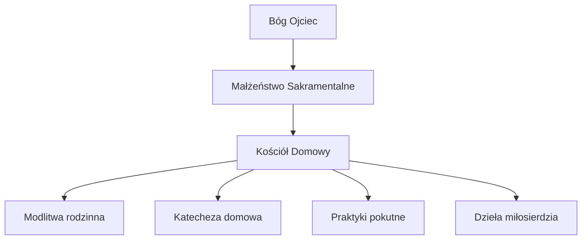
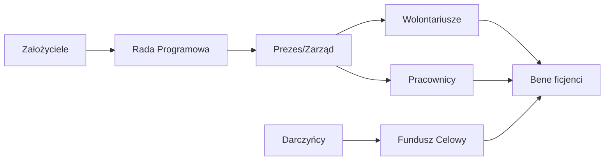

# 8.5 Ustawa o Wolności Sumienia i Wyznania oraz o Stowarzyszeniach

## Wstęp: Sacrum Wolności Ludzkiego Ducha

### 8.5.0 Preambuła Duchowa

> *„Bóg stworzył człowieka wolnym, na swój obraz i podobieństwo, obdarzając go rozumem i sercem zdolnym do rozróżnienia dobra od zła. Wolność sumienia i wyznania jest pierwszym darem Stwórcy, którego żadna władza ziemska nie może ograniczyć ani odebrać."*

Niniejszy rozdział stanowi kompleksowe opracowanie prawnej i duchowej podstawy funkcjonowania wspólnot wyznaniowych, kościołów domowych, stowarzyszeń świeckich oraz organizacji religijnych w kontekście Prawa Boskiego, Naturalnego, Rodowego i Osobowego. Dokument integruje perspektywę teologiczną, filozoficzną i prawną, ukazując wolność sumienia jako fundament ładu społecznego.

**Podstawa w Spisie Treści:**
- **8.5 Ustawa o Wolności Sumienia i Wyznania**
  - 8.5.1 Prawo do tworzenia wspólnot religijnych i świeckich
  - 8.5.2 Zakaz ingerencji państwa w sprawy wiary i sumienia
  - 8.5.3 Podstawa funkcjonowania Kościołów Domowych i organizacji charytatywnych

---

## Część I: Ontologia Wolności Sumienia i Wyznania

### 8.5.1 Teologiczne Źródła Wolności

#### A. Wolność jako Obraz Boży

Człowiek został stworzony *ad imaginem Dei* – na obraz i podobieństwo Boga. Ten obraz przejawia się przede wszystkim w:

| Cecha Boska | Odpowiednik w Człowieku | Przejaw Wolności |
|-------------|-------------------------|------------------|
| **Wola Twórcza** | Zdolność wyboru | Decyzje moralne i duchowe |
| **Rozum** | Zdolność poznania prawdy | Poszukiwanie Boga i sensu |
| **Miłość** | Zdolność relacji | Wspólnota i służba |
| **Suwerenność** | Niepodległość sumienia | Odporność na przymus |

**Prawo Boskie:** Wolność sumienia wynika bezpośrednio z natury Boga, który sam jest wolny i obdarza wolnością. Żadna istota stworzona nie może być zmuszana do aktu wiary lub jego zaniechania.

> *„Oto stanąłem przed tobą z życiem i śmiercią, z błogosławieństwem i przekleństwem. Wybieraj więc życie, abyś żył ty i twoje potomstwo."* (Pwt 30,19)

#### B. Chrystusowa Zasada Dobrowolności

Jezus Chrystus nigdy nie zmuszał do wiary:
- Zaproszenie: *„Chodź za Mną"* (Mk 10,21)
- Pytanie o zgodę: *„Czy chcesz wyzdrowieć?"* (J 5,6)
- Szacunek dla odmowy: bogaty młodzieniec odszedł smutny (Mk 10,22)
- Ostrzeżenie przed przymusem: *„Kto mieczem wojuje, od miecza ginie"* (Mt 26,52)

**Zasada:** Wiara wymuszona przemocą, presją społeczną lub sankcjami prawnymi nie ma wartości zbawczej. Bóg pragnie miłości dobrowolnej, nie zniewolonej.

#### C. Rola Sumienia

Sumienie (*synderesis*) to wewnętrzny głos Boga w sercu człowieka, zdolny do rozróżnienia dobra od zła niezależnie od zewnętrznych norm prawnych.

```
┌─────────────────────────────────────────────┐
│            HIERARCHIA SUMIENIA              │
├─────────────────────────────────────────────┤
│ 1. Sumienie Uformowane przez Prawdę         │
│    → Zgodne z Prawem Boskim i Naturalnym    │
├─────────────────────────────────────────────┤
│ 2. Sumienie Błędne ale Szczere              │
│    → Wymaga formacji, ale chronione         │
├─────────────────────────────────────────────┤
│ 3. Sumienie Stępione/Zniekształcone         │
│    → Wymaga nawrócenia i uzdrowienia        │
└─────────────────────────────────────────────┘
```

**Obowiązek Państwa:** Chronić prawo każdego człowieka do działania zgodnie z własnym sumieniem, o ile nie narusza to Prawa Naturalnego i dóbr wspólnych.

---

### 8.5.2 Filozoficzne Podstawy Autonomii Duchowej

#### A. Personalizm Chrześcijański

Osoba ludzka jest **celem samym w sobie**, a nie środkiem do realizacji celów państwa, gospodarki czy ideologii. Wynika z tego:

1. **Nienaruszalność sfery wewnętrznej** – myśli, przekonania, intencje są poza zasięgiem władzy publicznej.
2. **Prymat rodziny nad państwem** – rodzina jest pierwszą szkołą wiary i sumienia.
3. **Subsidiarność** – państwo powinno wspierać, a nie zastępować inicjatywy oddolne.

#### B. Prawo Naturalne a Wolność Wyznania

Prawo Naturalne, wpisane w ludzką naturę, nakazuje:
- Szukać prawdy o Bogu i sensie życia
- Żyć zgodnie z poznaną prawdą
- Tworzyć wspólnoty dla kultu i wzajemnej pomocy
- Przekazywać wiarę potomstwu

**Każde prawo stanowione sprzeczne z tymi zasadami jest nieważne z mocy samego Prawa Naturalnego (*lex iniusta non est lex*).**

#### C. Granice Wolności

Wolność sumienia nie jest absolutna w sensie anarchicznym. Jej granice wyznaczają:

| Źródło | Granica | Przykład |
|--------|---------|----------|
| **Prawo Boskie** | Zakaz czynienia zła | Nie można powoływać się na „wolność" dla usprawiedliwienia grzechu |
| **Prawo Naturalne** | Godność innych osób | Wolność kończy się tam, gdzie zaczyna się krzywda bliźniego |
| **Porządek Publiczny** | Bezpieczeństwo wspólnoty | Zakaz praktyk zagrażających życiu lub zdrowiu |
| **Prawo Rodowe** | Dobro rodziny | Rodzice nie mogą pozbawiać dzieci podstawowej formacji moralnej |

---

## Część II: Prawo do Tworzenia Wspólnot Religijnych i Świeckich

### 8.5.3 Typologia Wspólnot według Prawa Wszelakiego

#### A. Wspólnoty Pierwotne (Naturalne)

**1. Kościół Domowy (Ecclesia Domesticus)**
- **Podmiot:** Rodzina (małżonkowie + dzieci)
- **Podstawa:** Sakrament Małżeństwa, Chrzest
- **Charakter:** Najmniejsza komórka Kościoła, miejsce pierwszej ewangelizacji
- **Prawo:** Istnieje z mocy Prawa Boskiego i Naturalnego, niezależnie od rejestracji państwowej



**2. Krąg Modlitewny**
- **Podmiot:** Grupa wiernych (min. 3 osoby)
- **Cel:** Wspólna modlitwa, dzielenie się Słowem
- **Status:** Nie wymaga zgody władz, opiera się na prawie do zgromadzeń

**3. Wspólnota Charytatywna**
- **Podmiot:** Grupa osób dobrej woli
- **Cel:** Pomoc ubogim, chorym, marginalizowanym
- **Podstawa:** Przykazanie miłości bliźniego

#### B. Wspólnoty Wtórne (Organizacyjne)

**1. Stowarzyszenie Wiernych**
- **Forma prawna:** Rejestrowe lub nierejestrowe
- **Cel:** Apostolat, formacja, działalność społeczna
- **Zarząd:** Prezes + Rada (triarchia)

**2. Fundacja Religijna**
- **Majątek:** Dobra przekazane na cele kultu/charytatywne
- **Nadzór:** Rada Fundatorów + Kurator Duchowy
- **Trwałość:** Cele wieczyste

**3. Kościół Wyznaniowy**
- **Struktura:** Hierarchia sakralna (biskupi, kapłani, diakoni)
- **Autonomia:** Pełna samodzielność w sprawach doktrynalnych i liturgicznych
- **Rejestracja:** Wpis do rejestru MSWiA (dla skutków cywilnoprawnych)

---

### 8.5.4 Procedura Powoływania Wspólnot

#### Krok 1: Rozpoznanie Powołania (Discernment)

```
┌──────────────────────────────────────────────┐
│   ETAP ROZEZNANIA Duchowego                  │
├──────────────────────────────────────────────┤
│ □ Modlitwa o światło Ducha Świętego          │
│ □ Konsultacja z kierownikiem duchowym        │
│ □ Analiza motywacji (czy chwała Boża?)       │
│ □ Ocena potrzeb środowiska                   │
│ □ Sprawdzenie zgodności z Prawem Boskim      │
└──────────────────────────────────────────────┘
```

#### Krok 2: Sformułowanie Charyzmatu

**Dokument założycielski** powinien zawierać:
1. Nazwę wspólnoty
2. Cel duchowy i apostolski
3. Wartości fundamentalne
4. Strukturę władz (triarchia)
5. Zasady przyjmowania członków
6. Relacje z Kościołem Powszechnym i władzami cywilnymi

#### Krok 3: Akt Erekcyjny

> *„My, niżej podpisani, w obecności Boga Trójjedynego i na podstawie Prawa Naturalnego oraz Boskiego, ustanawiamy [NAZWA WSPÓLNOTY] jako trwałą wspólnotę wiernych, zobowiązując się do realizacji celu: [CEL]."*

**Podpisy założycieli** (min. 3 osoby dla stabilności) + data + miejsce.

#### Krok 4: Powiadomienie Władz (opcjonalne)

Dla uzyskania osobowości prawnej w obrocie cywilnoprawnym:
- Zgłoszenie do sądu rejestrowego (stowarzyszenie/fundacja)
- Lub wniosek o wpis do rejestru wyznań (kościół)

**UWAGA:** Brak rejestracji **nie odbiera** wspólnocie prawa istnienia ani wykonywania czynności duchowych (sakramenty, modlitwa, nauczanie).

---

## Część III: Zakaz Ingerencji Państwa w Sprawy Wiary i Sumienia

### 8.5.5 Zasada Rozdziału Sfery Duchowej od Doczesnej

#### A. Dualizm Władz

```
┌─────────────────────────────────┐   ┌─────────────────────────────────┐
│      SFERA DUCHOWA              │   │      SFERA DOCZESNA             │
│      (Auctoritas Spiritualis)   │   │      (Potestas Temporalis)      │
├─────────────────────────────────┤   ├─────────────────────────────────┤
│ • Doktryna i dogmaty            │   │ • Prawo karne i cywilne         │
│ • Liturgia i sakramenty         │   │ • Administracja publiczna       │
│ • Dyscyplina kościelna          │   │ • Polityka społeczna            │
│ • Powołania duchowne            │   │ • Gospodarka i finanse          │
│ • Sumienie wiernych             │   │ • Bezpieczeństwo publiczne      │
└─────────────────────────────────┘   └─────────────────────────────────┘
              ↓                                   ↓
        SŁOWO BOŻE                         PRAWO STANOWIONE
```

**Zasada:** Każda sfera jest suwerenna w swoim zakresie. Państwo nie może:
- Narzucać doktryny religijnej
- Mieszać się w wybór hierarchów kościelnych
- Kontrolować treści kazań i nauczania
- Wymagać zgody na sprawowanie sakramentów

#### B. Wyjątki: Interes Publiczny

Państwo może interweniować TYLKO gdy:

| Sytuacja | Warunek Interwencji | Limit |
|----------|---------------------|-------|
| **Przestępstwo** | Czyn zabroniony pod groźbą kary | Tylko czyn, nie przekonanie |
| **Zagrożenie życia** | Bezpośrednie niebezpieczeństwo | Proporcjonalność środków |
| **Ochrona małoletnich** | Nadużycia wobec dzieci | Nadzór, nie likwidacja wspólnoty |
| **Porządek publiczny** | Zakłócenie spokoju | Minimalna niezbędna ingerencja |

**Zakazane formy ingerencji:**
- ❌ Cenzura prewencyjna tekstów religijnych
- ❌ Nakaz zmiany statutu wspólnoty
- ❌ Wymaganie lojalności wobec ideologii państwowej
- ❌ Diskryminacja w dostępie do usług publicznych ze względu na wyznanie

---

### 8.5.6 Ochrona Prawna Wolności Sumienia

#### A. Poziom Konstytucyjny

Konstytucja RP (art. 53) gwarantuje:
1. Wolność wyznania i religii
2. Równość wszystkich wyznań wobec prawa
3. Autonomię związków wyznaniowych
4. Naukę religii w szkołach (na życzenie)

**Klauzula sumienia:** Prawo do odmowy działań sprzecznych z sumieniem (np. aborcja, eutanazja, przysiędze niezgodne z wiarą).

#### B. Poziom Międzynarodowy

- **Powszechna Deklaracja Praw Człowieka** (art. 18)
- **Europejska Konwencja Praw Człowieka** (art. 9)
- **Międzynarodowy Pakt Praw Obywatelskich i Politycznych** (art. 18)

**Mechanizm skargi:** Jednostka może wnieść skargę do ETPC w Strasburgu w przypadku naruszenia wolności religijnej przez państwo.

#### C. Poziom Prawa Boskiego

> *„Bądź wierny aż do śmierci, a dam ci koronę życia."* (Ap 2,10)

Wierny ma **obowiązek moralny** sprzeciwić się prawu ludzkiemu, jeśli jest sprzeczne z Prawem Boskim (zasada *Non possumus* – „Nie możemy").

**Przykłady historyczne:**
- Św. Tomasz More – odmowa uznania króla głową Kościoła
- Św. Maksymilian Kolbe – ofiara życia w obronie godności
- Ojciec Jerzy Popiełuszko – kazania o prawdzie mimo represji

---

## Część IV: Funkcjonowanie Kościołów Domowych i Organizacji Charytatywnych

### 8.5.7 Kościół Domowy jako Fundament Nowej Ewangelizacji

#### A. Struktura Kościoła Domowego

```
┌─────────────────────────────────────────────┐
│           KOŚCIÓŁ DOMOWY                    │
│        (Rodzina Sakramentalna)              │
├─────────────────────────────────────────────┤
│  OJCIEC (Głowa)                             │
│  • Prowadzi modlitwę                        │
│  • Reprezentuje rodzinę                     │
│  • Czuwa nad formacją synów                 │
├─────────────────────────────────────────────┤
│  MATKA (Serce)                              │
│  • Nadzoruje życie duchowe                  │
│  • Katechizuje dzieci                       │
│  • Czuwa nad córkami                        │
├─────────────────────────────────────────────┤
│  DZIECI (Przyszłość)                        │
│  • Uczestniczą w modlitwie                  │
│  • Przyswajają wartości                     │
│  • Kontynuują dziedzictwo                   │
└─────────────────────────────────────────────┘
```

#### B. Program Formacyjny Kościoła Domowego

**Codziennie:**
- Modlitwa poranna i wieczorna (Liturgia Godzin uproszczona)
- Rachunek sumienia
- Lektura Pisma Świętego (lectio divina)

**Co Tydzień:**
- Niedzielna Msza Święta (lub nabożeństwo w przypadku przeszkód)
- Spotkanie małżeńskie (rozmowa duchowa)
- Post lub umartwienie dobrowolne

**Co Miesiąc:**
- Dzień skupienia (recollection)
- Spowiedź święta
- Dzieło miłosierdzia (pomoc ubogim)

**Raz w Roku:**
- Rekolekcje rodzinne
- Pielgrzymka do sanktuarium
- Obrachunek roku duchowego

#### C. Prawa i Obowiązki

| Prawa | Obowiązki |
|-------|-----------|
| Do prywatności życia rodzinnego | Do zapewnienia formacji dzieciom |
| Do wyboru metody wychowawczej | Do poszanowania godności każdego członka |
| Do ochrony przed ideologizacją | Do przekazywania skarbu wiary |
| Do wsparcia ze strony wspólnoty | Do solidarności z innymi rodzinami |

---

### 8.5.8 Organizacje Charytatywne jako Wyraz Miłości Społecznej

#### A. Teologia Działania Charytatywnego

> *„Wszystko, co uczyniliście jednemu z tych braci moich najmniejszych, Mnieście uczynili."* (Mt 25,40)

Dzieła miłosierdzia są **sakramentaliami** – widzialnymi znakami niewidzialnej łaski Bożej. Organizacja charytatywna jest zorganizowaną formą miłości bliźniego.

#### B. Model Organizacyjny



#### C. Obszary Działalności

1. **Caritas Materialis** – pomoc materialna (żywność, odzież, schronienie)
2. **Caritas Spiritualis** – wsparcie duchowe (modlitwa, poradnictwo, rekolekcje)
3. **Caritas Intellectualis** – edukacja i formacja (szkoły, warsztaty, publikacje)
4. **Caritas Socialis** – integracja i adwokatura (prawa marginalizowanych)

#### D. Zasady Etyczne Organizacji Charytatywnej

| Zasada | Opis |
|--------|------|
| **Godność beneficjenta** | Pomoc nie może upokarzać; dawca i biorca są równi w godności |
| **Subsidiarność** | Wspierać samodzielność, nie uzależniać |
| **Transparentność** | Jasne zasady przydzielania środków |
| **Bezstronność** | Pomoc bez dyskryminacji wyznaniowej, rasowej, politycznej |
| **Zrównoważenie** | Długofalowe projekty, nie tylko doraźna pomoc |

---

## Część V: Studium Przypadków i Mechanizmy Ochrony

### 8.5.9 Studia Przypadków (Case Studies)

#### Studium A: Rejestracja Kościoła Domowego w Czasach Prześladowań

**Sytuacja:** Rodzina Kowalskich w kraju totalitarnym chce prowadzić życie sakramentalne bez rejestracji w państwowym rejestrze wyznań.

**Rozwiązanie:**
1. Powołanie Kościoła Domowego na podstawie Prawa Boskiego (sakrament małżeństwa)
2. Brak wniosku o rejestrację państwową
3. Sprawowanie Eucharystii w domu przez kapłana odwiedzającego
4. Dokumentacja w formie prywatnych zapisków (ochrzty, bierzmowania)
5. Kontakt z Kościołem podziemnym

**Skutek prawny:** Państwo nie ma podstaw do ingerencji, gdyż Kościół Domowy istnieje z mocy Prawa Naturalnego i Boskiego, nie wymagając koncesji państwowej.

#### Studium B: Klauzula Sumienia Pracownika Medycznego

**Sytuacja:** Pielęgniarka Anna otrzymuje polecenie uczestnictwa w zabiegu aborcji.

**Rozwiązanie:**
1. Pisemne oświadczenie powołania się na klauzulę sumienia
2. Powołanie się na art. 39 Kodeksu Etyki Lekarskiej i ustawę o zawodzie pielęgniarki
3. Zgoda na wykonanie innych obowiązków niezwiązanych z aborcją
4. W przypadku nacisków – skarga do Rzecznika Praw Pacjenta i Sądu Pracy

**Skutek prawny:** Pracodawca nie może dyskryminować pracownika z powodu klauzuli sumienia; ewentualne zwolnienie jest nieważne z mocy Prawa Naturalnego.

#### Studium C: Stowarzyszenie Wiernych Tradycji Łacińskiej

**Sytuacja:** Grupa wiernych chce utworzyć stowarzyszenie promujące mszę trydencką, napotykając opór władz diecezjalnych.

**Rozwiązanie:**
1. Powołanie stowarzyszenia wiernych na podstawie Kodeksu Prawa Kanonicznego (kan. 298-329)
2. Rejestracja cywilna jako stowarzyszenie zwykłe
3. Działalność bez zgody hierarchy (prawo wiernych do zrzeszania się)
4. Staranie się o zatwierdzenie jako stowarzyszenie papieskie

**Skutek prawny:** Stowarzyszenie istnieje legalnie; brak zatwierdzenia kościelnego ogranicza jedynie niektóre przywileje, nie odbiera prawa istnienia.

---

### 8.5.10 Mechanizmy Obrony przed Naruszeniami Wolności Religijnej

#### Poziom 1: Indywidualny

- **Modlitwa i post** – walka duchowa
- **Dokumentacja naruszeń** – dziennik zdarzeń
- **Edukacja prawna** – znajomość przepisów
- **Wsparcie wspólnoty** – solidarność wiernych

#### Poziom 2: Wspólnotowy

- **Interwencja przełożonych kościelnych**
- **Listy otwarte do władz**
- **Kampanie informacyjne**
- **Bojkot instytucji dyskryminujących**

#### Poziom 3: Prawny

- **Skarga administracyjna**
- **Pozew cywilny o ochronę dóbr osobistych**
- **Zawiadomienie o przestępstwie**
- **Skarga konstytucyjna**

#### Poziom 4: Międzynarodowy

- **Skarga do ETPC**
- **Raporty do ONZ (Special Rapporteur on Freedom of Religion)**
- **Adwokacja w Parlamencie Europejskim**
- **Solidarność międzynarodowych organizacji katolickich**

---

## Część VI: Praktyczne Narzędzia i Formularze

### 8.5.11 Wzór Aktu Założycielskiego Kościoła Domowego

```
AKT EREKCYJNY KOŚCIOŁA DOMOWEGO
pod wezwaniem [WEZWANIE]

My, niżej podpisani:
1. [Imię i Nazwisko] – ojciec rodziny
2. [Imię i Nazwisko] – matka rodziny
3. [Imiona dzieci] – członkowie rodziny

w dniu [DATA] w miejscu [MIEJSCE], w obecności Boga Trójjedynego i na podstawie:
- Prawa Boskiego (sakrament małżeństwa),
- Prawa Naturalnego (pierwsze prawo rodziny do wychowania w wierze),
- Prawa Kanonicznego (kan. 1136),
- Konstytucji RP (art. 53),

niniejszym ustanawiamy KOŚCIÓŁ DOMOWY pod wezwaniem [WEZWANIE], zobowiązując się do:
1. Codziennej modlitwy rodzinnej
2. Niedzielnej celebracji Eucharystii lub Słowa Bożego
3. Formacji dzieci w duchu wiary katolickiej
4. Dzieł miłosierdzia wobec potrzebujących
5. Łączności z Kościołem Powszechnym pod przewodnictwem Papieża

Na dowód czego składamy podpisy:

_______________________     _______________________
Ojciec                      Matka

Świadkowie (opcjonalnie):
_______________________     _______________________
```

---

### 8.5.12 Checklista Legalności Wspólnoty

```
□ Cel wspólnoty jest zgodny z Prawem Boskim i Naturalnym
□ Statut/Regulamin został sporządzony na piśmie
□ Władze zostały wybrane w sposób przejrzysty (triarchia)
□ Członkowie zostali poinformowani o prawach i obowiązkach
□ Majątek wspólnoty jest ewidencjonowany
□ Sprawozdania są udostępniane członkom
□ Działalność nie narusza porządku publicznego
□ Wspólnota respektuje klauzulę sumienia członków
□ Istnieje procedura rozwiązywania sporów wewnętrznych
□ Zapewniona jest ochrona danych osobowych
```

---

### 8.5.13 Modlitwa o Wolność Kościoła

> *„Wszechmogący Boże, Stwórco i Panie wszechświata, który obdarzyłeś człowieka wolną wolą i uczyniłeś go na swój obraz i podobieństwo:*
>
> *Prosimy Cię, broń swojego Kościoła przed wszelkimi zakusami tyrani i zniewolenia. Chroń nasze sumienia przed manipulacją i przymusem.*
>
> *Daj nam odwagę świadczenia o prawdzie nawet wobec prześladowań. Umocnij rodziny, by były wiernymi Kościołami domowymi.*
>
> *Błogosław naszym pasterzom, by prowadzili nas drogą sprawiedliwości i miłości. Spraw, byśmy zawsze wybierali Ciebie ponad ziemskie korzyści.*
>
> *Przez Chrystusa Pana naszego, który żyje i króluje na wieki wieków. Amen."*

---

## Część VII: Synteza i Perspektywy

### 8.5.14 Zasady Nadrzędne Rozdziału 8.5

| Nr | Zasada | Źródło | Zastosowanie |
|----|--------|--------|--------------|
| 1 | **Prymat Sumienia** | Prawo Boskie | Żadne prawo ludzkie nie może zmuszać do działania przeciw sumieniu |
| 2 | **Autonomia Wspólnot** | Prawo Naturalne | Państwo nie może ingerować w wewnętrzne sprawy wyznań |
| 3 | **Równość Wyznań** | Prawo Konstytucyjne | Wszystkie związki wyznaniowe mają równe prawa |
| 4 | **Subsidiarność** | Nauka Społeczna Kościoła | Państwo wspiera, nie zastępuje inicjatywy oddolne |
| 5 | **Ochrona Rodziny** | Prawo Rodowe | Rodzina ma pierwsze prawo do wychowania religijnego dzieci |
| 6 | **Solidarność** | Prawo Osobowe | Wierni mają obowiązek wzajemnej pomocy w obronie wolności |

---

### 8.5.15 Wyzwania Przyszłości

1. **Cyfryzacja życia religijnego** – duszpasterstwo online, ochrona danych wiernych
2. **Relatywizm światopoglądowy** – obrona prawdy obiektywnej w kulturze postprawdy
3. **Globalizm vs. lokalność** – zachowanie tożsamości lokalnych Kościołów
4. **Ekologia integralna** – troska o stworzenie jako wymiar duchowości
5. **Dialog międzyreligijny** – szukanie jedności w różnorodności bez synkretyzmu

---

## Aneks A: Deklaracja Wolności Sumienia

> *„Ja, niżej podpisany/a [IMIE I NAZWISKO], oświadczam z pełną świadomością i dobrowolnie, że:*
>
> 1. Moje sumienie jest wolne i podlega wyłącznie Prawu Boskiemu i Naturalnemu.
> 2. Nie uznaję żadnej władzy ludzkiej za uprawnioną do nakazania mi działania przeciw mojemu sumieniu.
> 3. Zobowiązuję się do szanowania wolności sumienia innych ludzi, o ile nie narusza ona Prawa Boskiego.
> 4. Gotów/gotowa jestem ponieść konsekwencje prawne mojego świadectwa, ufając w ochronę Bożą.
> 5. Niniejsza deklaracja jest wyrazem mojej wierności Chrystusowi i Jego Kościołowi.
>
> *Data: _______________     Podpis: _______________"*

---

## Aneks B: Bibliografia i Źródła

### Źródła Prawne
1. Konstytucja Rzeczypospolitej Polskiej (1997) – art. 53-55
2. Ustawa o gwarancjach wolności sumienia i wyznania (1989)
3. Kodeks Prawa Kanonicznego (1983) – kan. 208-223, 298-329
4. Europejska Konwencja Praw Człowieka – art. 9
5. Powszechna Deklaracja Praw Człowieka – art. 18

### Źródła Teologiczne
6. Sobór Watykański II – Deklaracja *Dignitatis Humanae* (1965)
7. Jan Paweł II – Encyklika *Veritatis Splendor* (1993)
8. Benedykt XVI – Przemówienie do Bundestagu (2011)
9. Franciszek – Encyklika *Fratelli Tutti* (2020)
10. Katechizm Kościoła Katolickiego – nr 1776-1802, 2104-2109

### Źródła Filozoficzne
11. Jacques Maritain – *Człowiek i Państwo*
12. Karol Wojtyła – *Osoba i czyn*
13. John Henry Newman – *List do księcia Norfolk* (o sumieniu)
14. Thomas More – *Dialog o pocieszeniu w ucisku*

### Opracowania
15. Piotr Steczko – *Wolność sumienia w prawie polskim*
16. Marek Chmaj – *Klauzula sumienia w prawie medycznym*
17. Anna Tuniewicz – *Kościoły domowe w historii i współczesności*

---

## Podsumowanie Rozdziału 8.5

Rozdział 8.5 stanowi kompleksową podstawę prawną i duchową dla funkcjonowania wspólnot wyznaniowych i organizacji świeckich w harmonii z Prawem Boskim, Naturalnym, Rodowym i Osobowym. Kluczowe przesłania:

✅ **Wolność sumienia jest darem Bożym**, którego żadna władza ludzka nie może odebrać.
✅ **Kościół Domowy** jest fundamentalną komórką ewangelizacji, istniejącą z mocy sakramentu małżeństwa.
✅ **Państwo ma obowiązek chronić**, a nie ograniczać wolność religijną, respektując zasadę subsydiarności.
✅ **Organizacje charytatywne** są wyrazem miłości społecznej i uzupełniają działanie państwa.
✅ **Klauzula sumienia** jest niezbywalnym prawem każdego człowieka dobrej woli.

**Następny krok:** Przejście do rozdziału 8.6 (*Prawo Naturalne i oświadczenie woli*), który pogłębia temat tworzenia rzeczywistości prawnej przez akt wolnej woli zgodny z prawdą obiektywną.

---

*„Prawda was wyzwoli" (J 8,32)*
